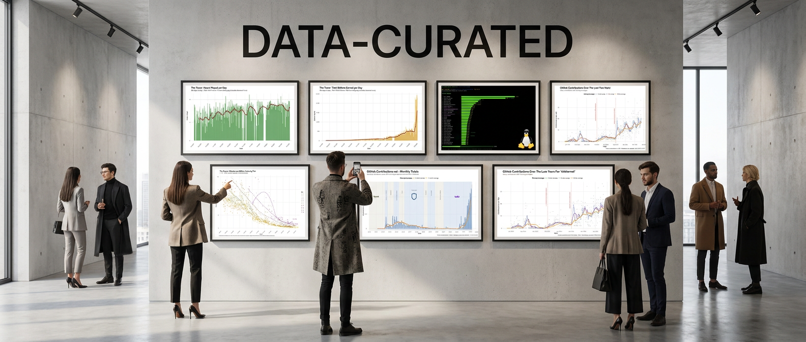

# data-curated

My collection of random data sets.

Some of these are related to projects I'm working on, but some of them are just for
practice with tools like [Datasette](https://datasette.io/) and [SQLite](https://sqlite.org/).

Each directory could be something interesting....

## Datasets

- 🦜 [**duolingo/**](duolingo/) - Spanish learning character data in TOML format with build scripts
- 🌐 [**good-sites/**](good-sites/) - Curated list of useful websites and learning resources
- 📊 [**individuals/**](individuals/) - Personal data collections and projects
  - 📈 [**chicks/blog/**](individuals/chicks/blog/) - Blog post frequency tracking with charts
  - 🎮 [**chicks/games/**](individuals/chicks/games/) - Game playlog analysis with charts (The Tower)
  - 🐙 [**chicks/github/**](individuals/chicks/github/) - GitHub activity data with charts (commits, contributions, reviews)
  - 📍 [**chicks/google-maps/**](individuals/chicks/google-maps/) - Google Maps review data processing
  - 💼 [**chicks/jobs/**](individuals/chicks/jobs/) - Career history and employer data
  - 🎬 [**chicks/youtube/**](individuals/chicks/youtube/) - YouTube video metadata with blog linking
  - 🏆 [**github-contrib/**](individuals/github-contrib/) - Contributor ranking tools and visualizations
- 📊 [**lottery/**](lottery/) - NY lottery winning numbers (CSV) and CA jackpot tracker (Go/SQLite) with charts
- 🏙️ [**us-cities/**](us-cities/) - US city data from Census Bureau with coordinates and population (2010-2020)
- 🏛️ [**us-presidents/**](us-presidents/) - US president data with terms of office and birth states
- 📊 [**us-restaurants/**](us-restaurants/) - Restaurant density analysis using Census data with charts
- 🗺️ [**us-states/**](us-states/) - US state data in CSV, TSV, and SQLite formats

## Contributing

- [Code of Conduct](.github/CODE_OF_CONDUCT.md)
- [Contributing Guide](.github/CONTRIBUTING.md) includes a step-by-step guide to
  our [development process](.github/CONTRIBUTING.md#development-process).

## Support & Security

- [Getting Support](.github/SUPPORT.md)
- [Security Policy](.github/SECURITY.md)
