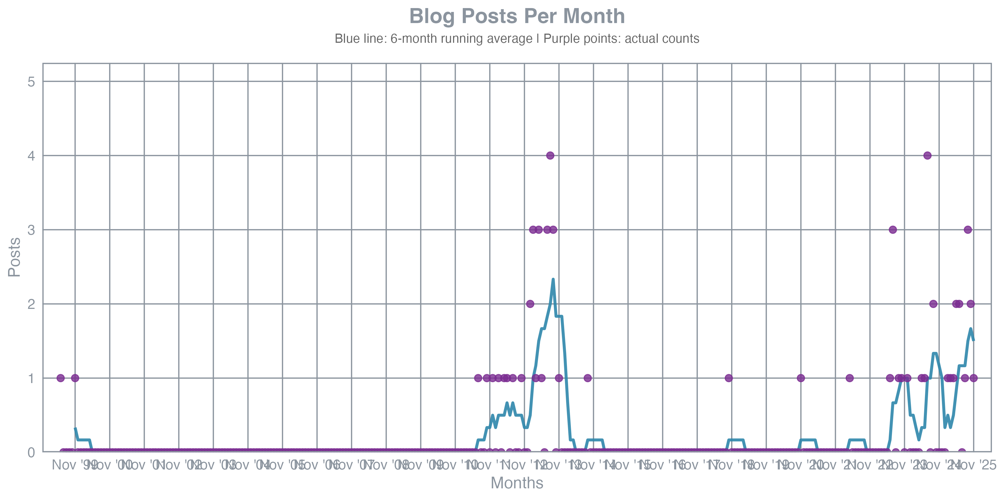
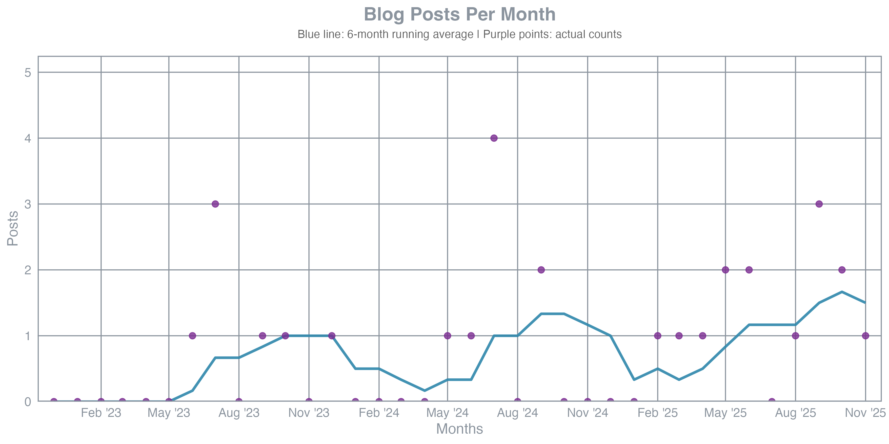

# Blog Post Counter & Graph Generator

Programs that count and visualize blog posts per month from
[chicks.net/posts](https://www.chicks.net/posts/).

- **Post Counter**: Go program that scrapes blog posts and generates CSV data
- **Graph Generator**: R script that visualizes post frequency with running averages
  (Go version kept for reference)

## Usage

### Using just (recommended)

From the repository root:

```bash
# Count blog posts and generate CSV
just count-posts

# Generate graph from CSV (all months)
just graph-posts

# Generate graph for last 36 months only
just graph-posts-36
```

### Direct execution

```bash
# Count posts
go run post-counter.go

# Generate graph (R version - used by justfile)
Rscript graph-generator.R blog-monthly-20251207.csv

# Generate graph for last 36 months (R version)
Rscript graph-generator.R blog-monthly-20251207.csv 36

# Generate graph (Go version - kept for reference)
go run graph-generator.go blog-monthly-20251207.csv

# Generate graph for last 36 months (Go version)
go run graph-generator.go blog-monthly-20251207.csv 36
```

## What It Does

### Post Counter (`post-counter.go`)

The post counter:

1. Fetches the blog posts page from `https://www.chicks.net/posts/`
2. Follows pagination links to gather all posts across multiple pages
3. Parses post dates using regex pattern matching
4. Groups posts by month (YYYY-MM format)
5. Writes results to CSV file named `blog-monthly-YYYYMMDD.csv`
6. Displays count of posts per month in chronological order

### Graph Generator (`graph-generator.R`)

**Current implementation (R version)** - used by justfile:

1. Reads the CSV file generated by the post counter
2. Fills in missing months with zero counts to show gaps
3. Optionally limits the graph to the last N months
4. Calculates 6-month running average for trend visualization
5. Generates high-resolution PNG graph with:
   - Blue line showing 6-month running average
   - Dark purple points showing actual monthly counts
   - Grid lines for readability
   - Axis labels (months on X-axis, post count on Y-axis)
   - GitHub-inspired color scheme
   - Publication-quality output (12×6 inches, 300 DPI)
6. Outputs PNG file with naming pattern:
   - All months: `blog-monthly-YYYYMMDD-chart.png`
   - Limited months: `blog-monthly-YYYYMMDD-chart-Nmo.png` (e.g., `chart-36mo.png`)

**Legacy implementation (`graph-generator.go`)** - kept for reference:

- Generates animated SVG files with smooth Catmull-Rom splines
- Output pattern: `blog-monthly-YYYYMMDD-graph.svg` or `graph-N.svg`
- See examples below for comparison with R version

## Output Format

### Console Output

```text
Posts per Month:
================
2025-05: 1
2025-06: 2
2025-08: 1
================
Total Posts: 10

Results written to: blog-monthly-20251207.csv
```

### CSV Output

The program creates a CSV file with the naming pattern `blog-monthly-YYYYMMDD.csv`
where YYYYMMDD is today's date. The CSV contains:

- Header row: `Month,Count`
- Data rows: Month in YYYY-MM format, post count for that month
- Sorted chronologically by month

### PNG Output (R version - current)

The R-based graph generator creates publication-quality PNG files:

**Filename patterns:**

- `blog-monthly-YYYYMMDD-chart.png` - Graph of all months
- `blog-monthly-YYYYMMDD-chart-36mo.png` - Graph of last 36 months

**Features:**

- High-resolution PNG (3600×1800 pixels, 300 DPI)
- 6-month running average line (blue) shows overall trends
- Individual data points (dark purple) show actual monthly counts
- Automatic Y-axis scaling based on max post count
- X-axis labels showing dates in "MMM 'YY" format
- Missing months filled with zero to show activity gaps
- Subtitle explains visualization elements

**Examples (R version):**

All months:



Last 36 months:



### SVG Output (Go version - legacy reference)

The original Go-based graph generator creates animated SVG files:

**Filename patterns:**

- `blog-monthly-YYYYMMDD-graph.svg` - Graph of all months
- `blog-monthly-YYYYMMDD-graph-36.svg` - Graph of last 36 months

**Features:**

- Responsive SVG that scales to any size
- Animated line drawing effect on load
- Smooth Catmull-Rom spline interpolation
- GitHub-style color scheme (#26a641 for the line)

**Examples (Go version for comparison):**

All months:


Last 36 months:


## Implementation Details

### Post Counter

- Uses standard library only (no external dependencies)
- Parses dates in format: "Month Day, Year" (e.g., "November 20, 2025")
- Automatically handles pagination by following "Next »" links
- Tracks visited URLs to avoid infinite loops
- Outputs results sorted chronologically by month

### Graph Generator (R version)

**Dependencies:**

- R packages: `ggplot2`, `scales`, `lubridate`, `zoo`
- Install with: `just install-r-deps` or `just install-r-package zoo`

**Implementation:**

- Fills in missing months between min and max dates
- Calculates 6-month running average using `zoo::rollmean()`
  - Window: 6 months (current month + 5 previous months)
  - Handles beginning months with insufficient data using `fill=NA`
- Supports optional month limit argument
- Uses ggplot2 for professional-quality visualization
- Color scheme:
  - Blue (#2E86AB): 6-month running average line
  - Dark purple (#7B2C91): Individual data points
  - Gray (#8b949e): Grid lines and text
- Automatically scales chart based on data range

### Graph Generator (Go version - legacy)

- Uses standard library only (no external dependencies)
- Fills in missing months between min and max dates
- Supports optional month limit argument
- Generates SVG with inline CSS styling
- Uses Catmull-Rom splines converted to cubic Bezier curves
- GitHub color scheme (#26a641 green line)
- Automatically scales chart based on data range
