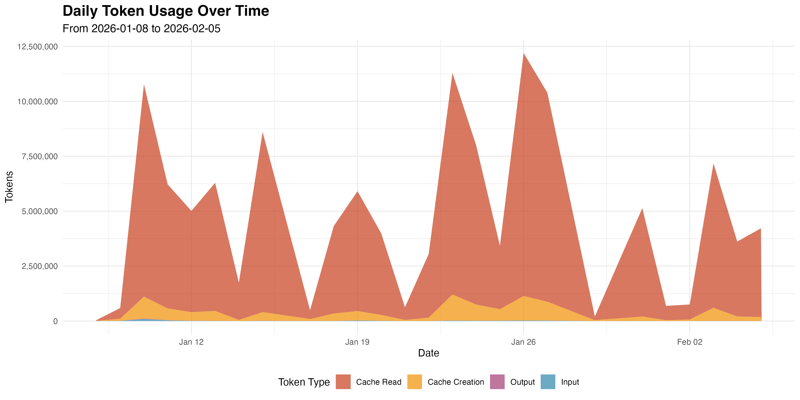
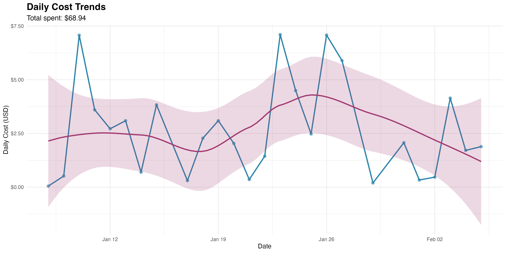
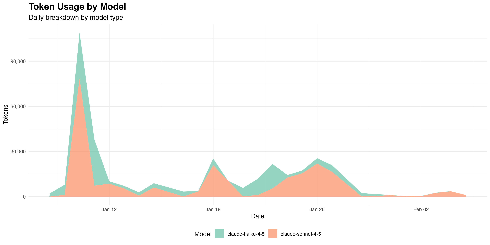
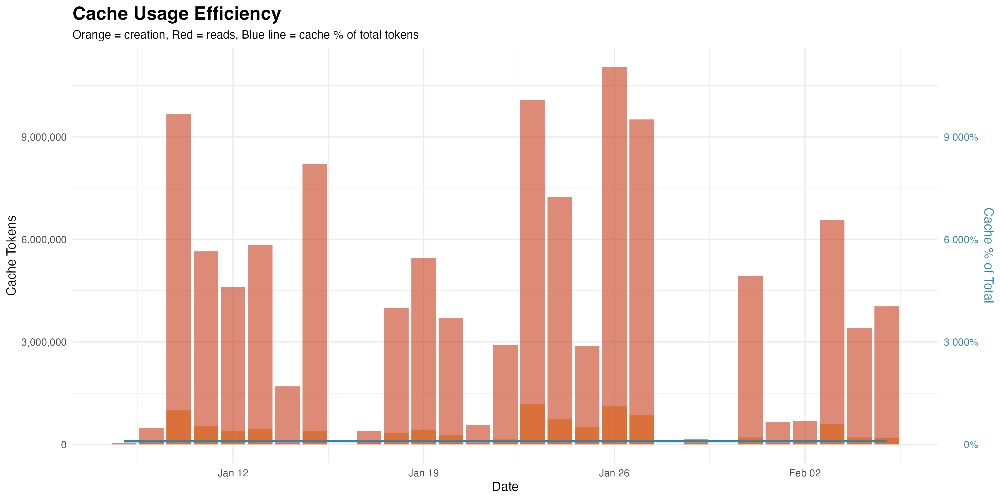
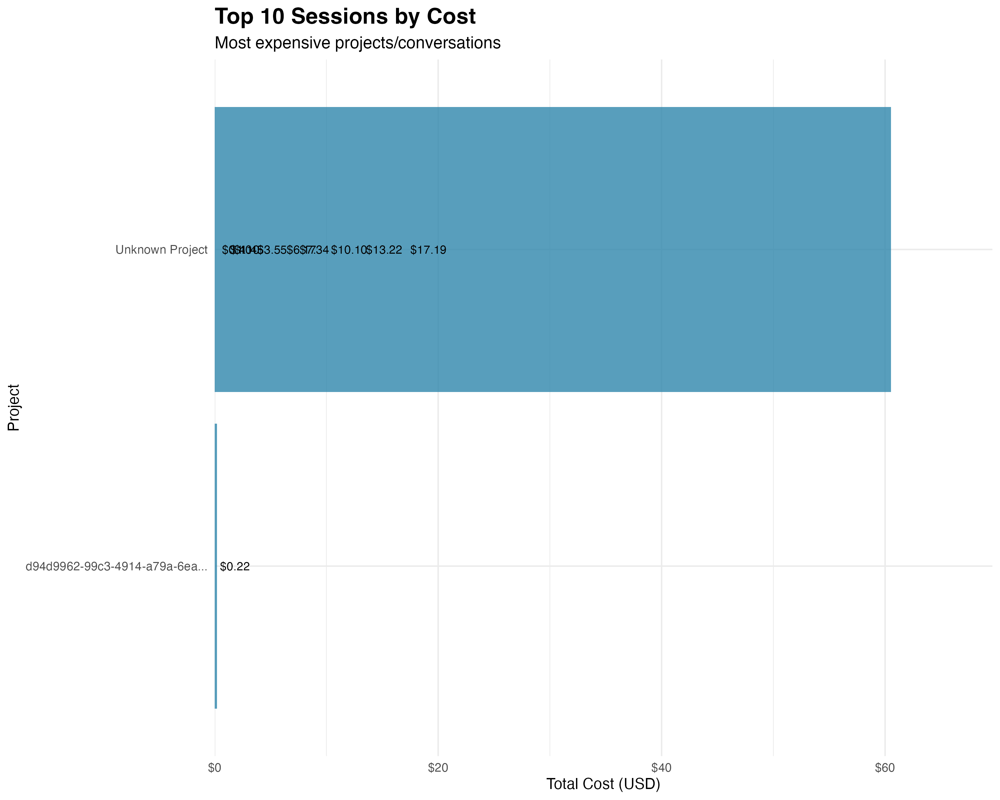
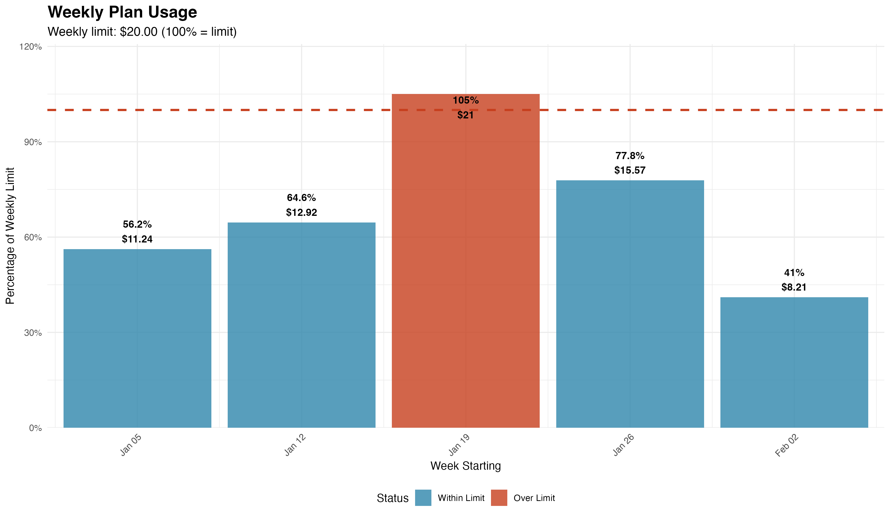

# Claude Code Usage Analysis

This directory contains R scripts for analyzing Claude Code token usage and cost
data from the `usage.db` SQLite database.

## Overview

The analysis examines token usage patterns, costs, model breakdowns, and cache
efficiency over time. It provides insights into how Claude Code is being used,
which models are most utilized, and how effectively caching is working.

## Prerequisites

```bash
# Install R (macOS)
brew install r

# Install required R packages (from repository root)
just install-r-deps
```

The analysis requires these R packages:

- DBI - Database interface
- RSQLite - SQLite database driver
- ggplot2 - Data visualization
- dplyr - Data manipulation
- tidyr - Data tidying
- lubridate - Date handling
- scales - Number formatting for plots

## Configuration

The analysis uses a weekly spending limit configured in `config.R`. To adjust
your weekly limit:

```bash
# Edit the configuration file
cd individuals/chicks/ccusage/usage-analysis
nano config.R

# Change the WEEKLY_LIMIT value (in USD)
WEEKLY_LIMIT <- 4.00  # Change this to your plan's weekly limit
```

The weekly limit is used to calculate what percentage of your plan you're
using each week and to highlight weeks that exceed the limit.

## Running the Analysis

```bash
# Recommended: Use the just command (from anywhere in the repo)
just analyze-ccusage

# Or run Rscript directly (from the repository root)
Rscript individuals/chicks/ccusage/usage-analysis/analyze-usage.R

# Or make it executable and run directly (from this directory)
chmod +x analyze-usage.R
./analyze-usage.R
```

## Output

The script generates both text output and visualizations:

### Text Output

- Summary statistics (total tokens, costs, date ranges)
- Model usage breakdown (costs and token counts by model)
- Top sessions by cost
- Cache efficiency metrics (creation, reads, hit ratio)
- Weekly plan usage breakdown (costs and percentages vs limit)

### Visualizations

#### 1. Token Usage Trends Over Time

Stacked area chart showing daily token usage broken down by type:
input, output, cache creation, and cache reads.



#### 2. Daily Cost Trends

Line chart showing daily costs with a trend line to visualize spending
patterns over time.



#### 3. Model Usage Breakdown

Stacked area chart showing token usage by model over time, revealing
which models are most utilized.



#### 4. Cache Efficiency

Combined chart showing cache creation and read tokens (bars) along with
cache percentage of total tokens (line), revealing how effectively caching
is reducing costs.



#### 5. Top Sessions by Cost

Horizontal bar chart showing the 10 most expensive sessions/projects,
helping identify which work consumed the most resources.



#### 6. Weekly Plan Usage

Bar chart showing weekly spending as a percentage of your configured weekly
limit. Bars are colored green if within limit, red if over limit. The dashed
line at 100% represents your weekly spending limit.



## Analysis Details

### Data Processing

- Loads daily usage, model breakdown, and session data from SQLite
- Converts dates and formats model names for readability
- Calculates cache efficiency metrics
- Identifies top sessions by cost

### Key Metrics

- **Total Tokens**: Sum of input, output, cache creation, and cache read tokens
- **Cache Hit Ratio**: How many times cache was read vs created
- **Model Breakdown**: Token usage and costs per model type
- **Session Costs**: Total spending per project/conversation
- **Daily Trends**: Usage and cost patterns over time
- **Weekly Plan Usage**: Percentage of weekly spending limit used each week

### Cache Efficiency

Cache tokens can significantly reduce costs:

- **Cache Creation**: Writing to cache (costs same as input tokens initially)
- **Cache Read**: Reading from cache (costs 10% of input token price)
- **Hit Ratio**: Higher ratios mean better cache utilization and lower costs

A cache hit ratio above 1.0 means the cache is being read more often than
it's being created, indicating good cache reuse.

## Data Source

The analysis uses data from `individuals/chicks/ccusage/usage.db`, which is
populated by the `fetch-usage.go` program that fetches data from the `ccusage`
command-line tool.

See `individuals/chicks/ccusage/README.md` for details on data collection.

## Related Commands

From repository root:

- `just fetch-ccusage` - Fetch latest usage data
- `just analyze-ccusage` - Run this analysis
- `just ccusage-db` - Open database in Datasette
- `just ccusage-stats` - Show summary statistics
