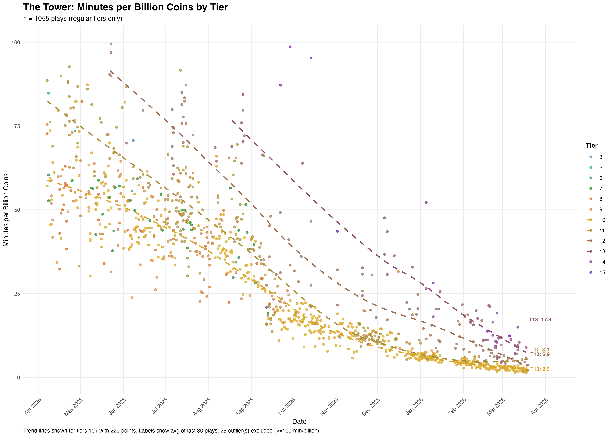
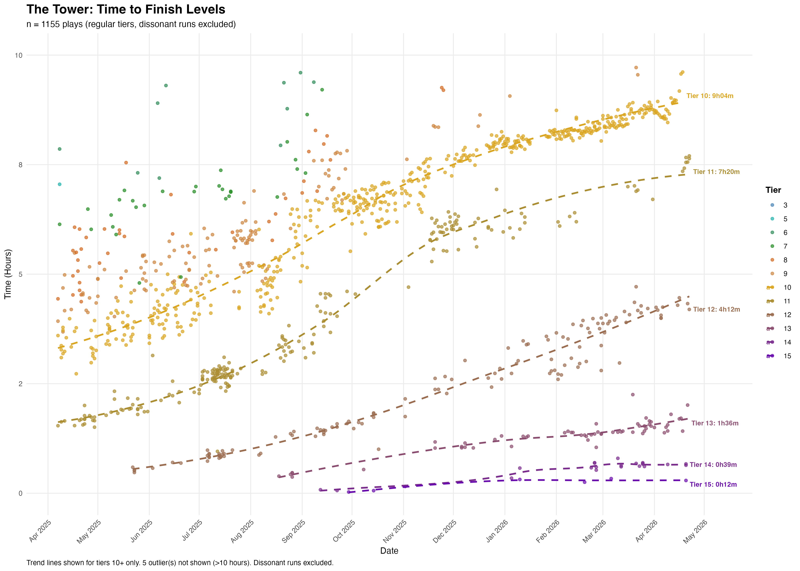
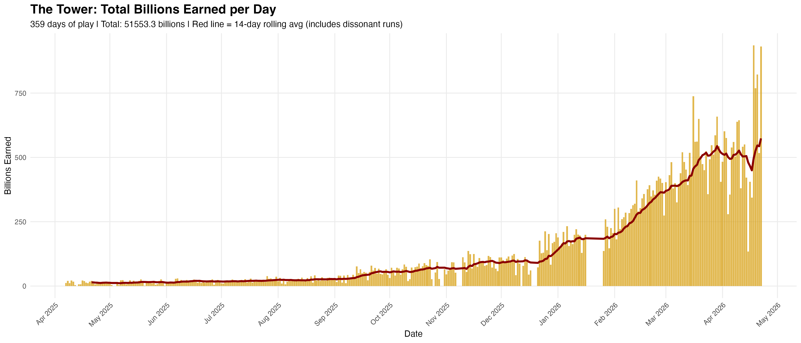
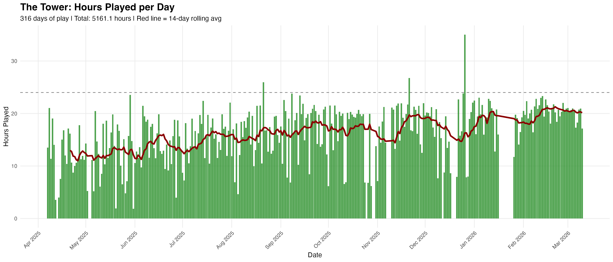
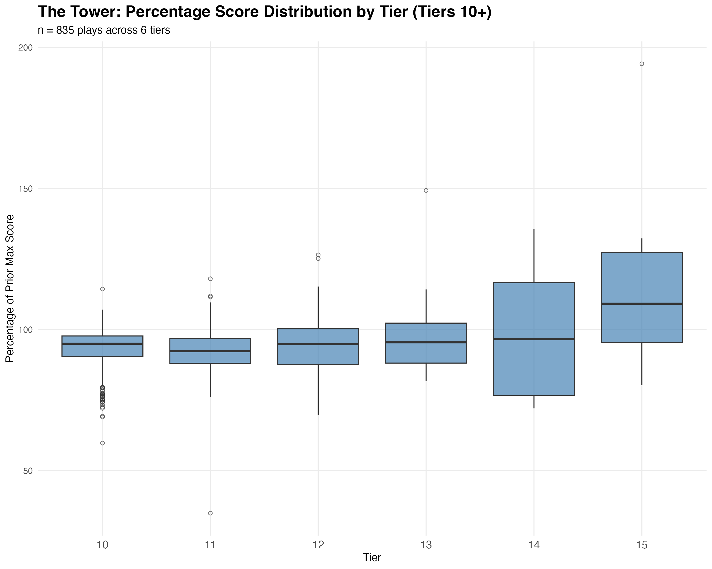
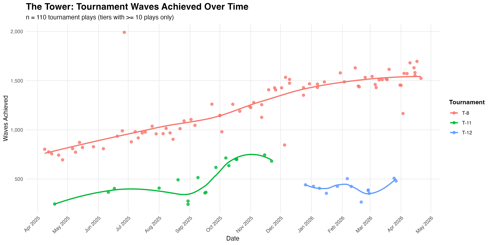
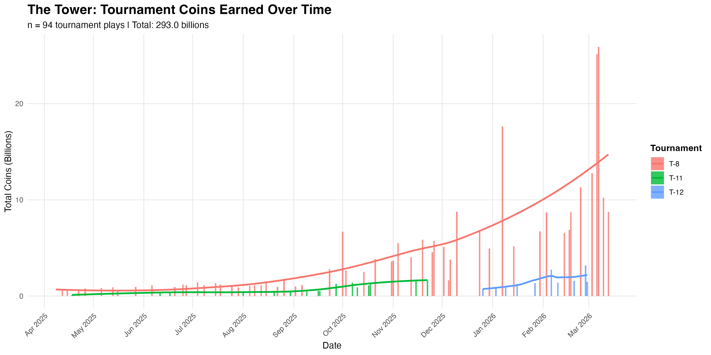
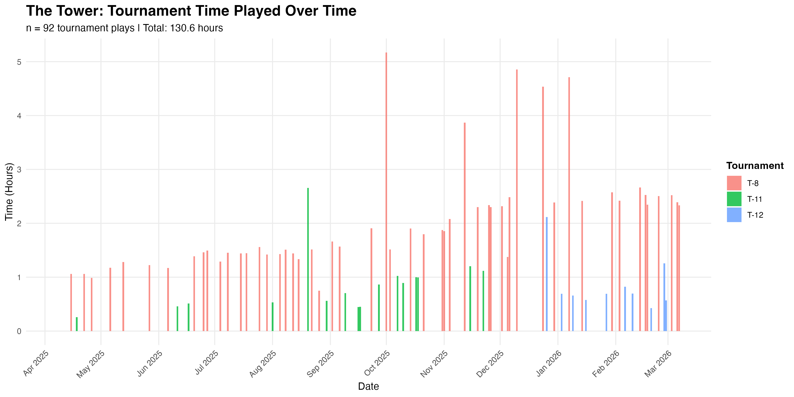

# The Tower

This is a game that baffles everyone who sees me playing it. I'm sure they'd
be even more baffled to discover I've been tracking my matches to discern any
signs of progress. I was able to gain some insights from this spreadsheet
itself, but I knew I wanted to eventually generate some scatter plots and
trend lines. Here it is.

## Links about the game

- [The Tower on the Google Play store](https://play.google.com/store/apps/details?id=com.TechTreeGames.TheTower&hl=en_US)
- [The Tower on the Apple App Store](https://apps.apple.com/us/app/the-tower-idle-tower-defense/id1575590830)
- [Notion wiki for The Tower](https://the-tower.notion.site/)
- [Tech Tree Games](https://www.techtreegames.com/) build a variety of idle games.

## Analysis

Graphs generated from playlog data:

### Tournament Analysis

Tournaments are special events tracked as negative tier numbers. Analysis only includes tiers with 10+ plays.

