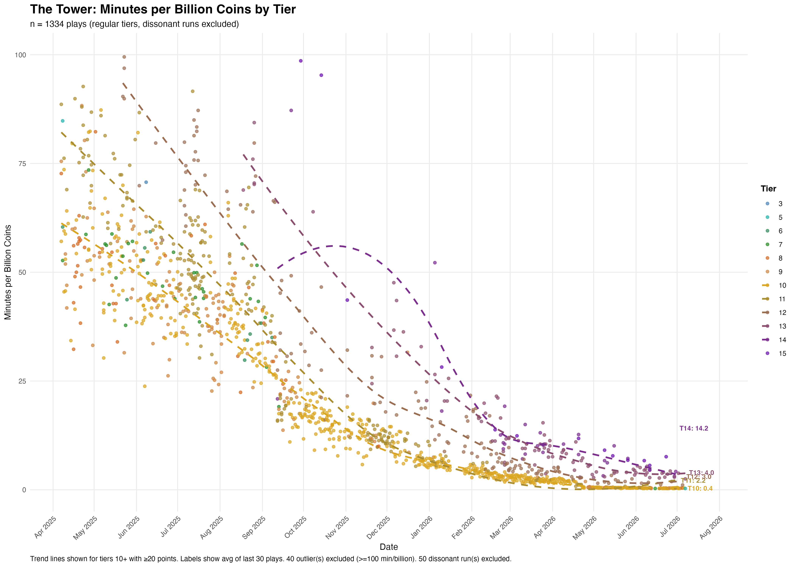
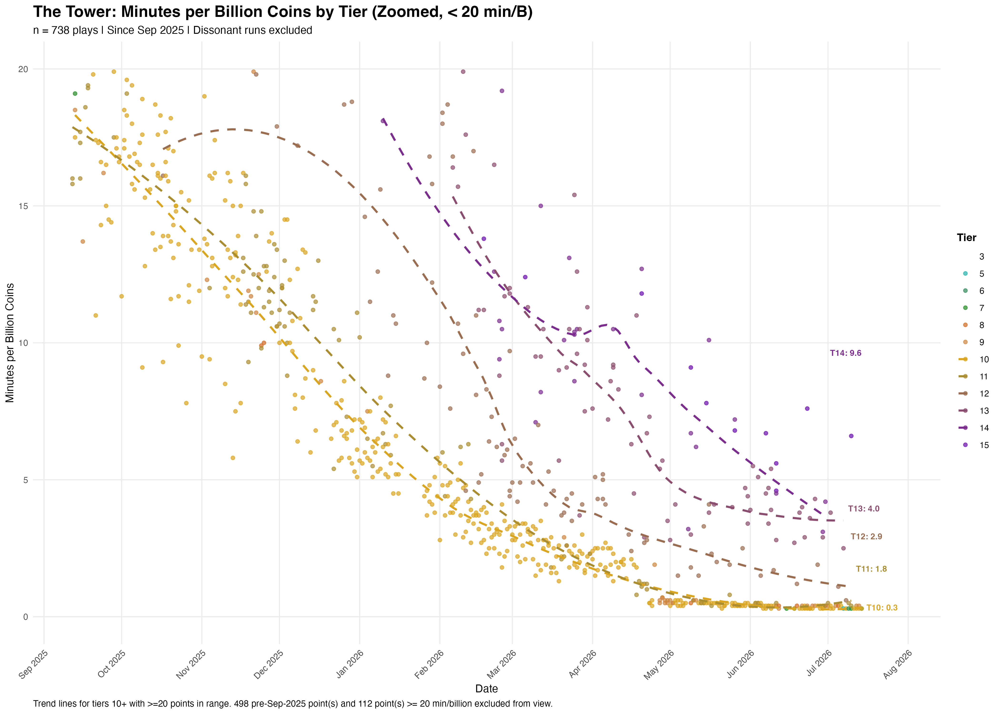
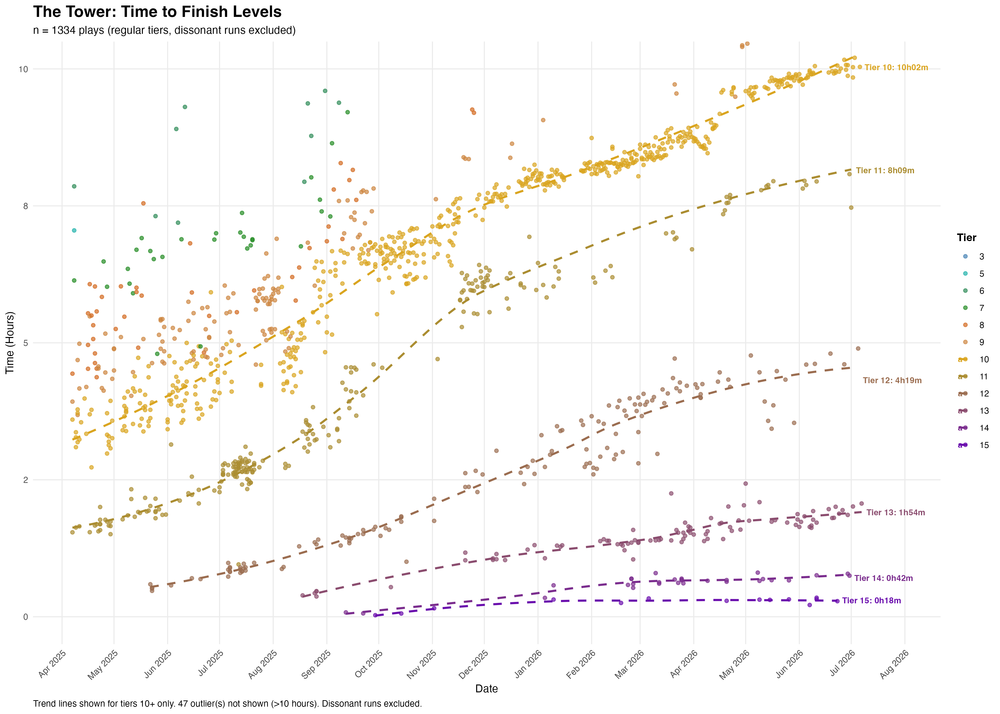
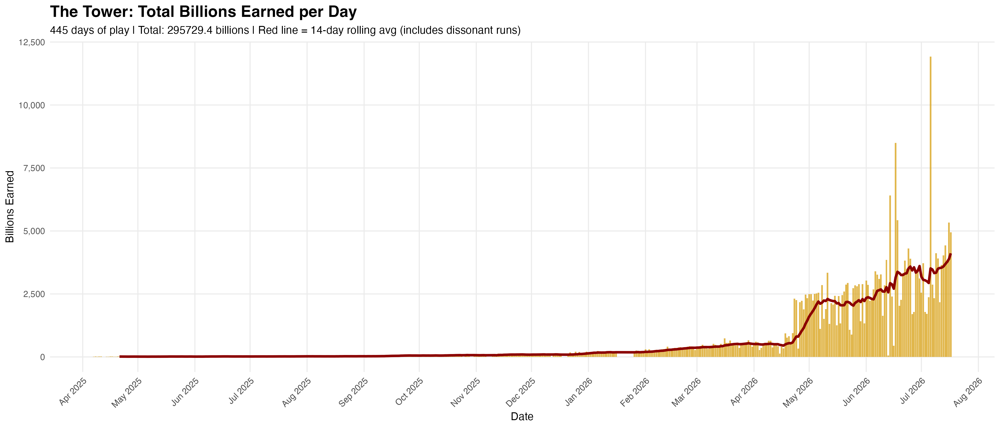
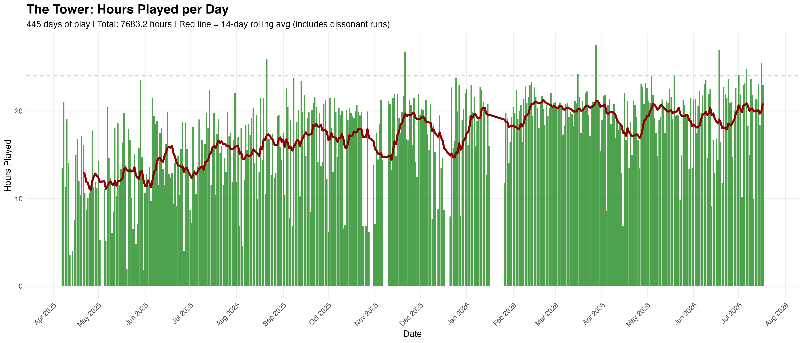
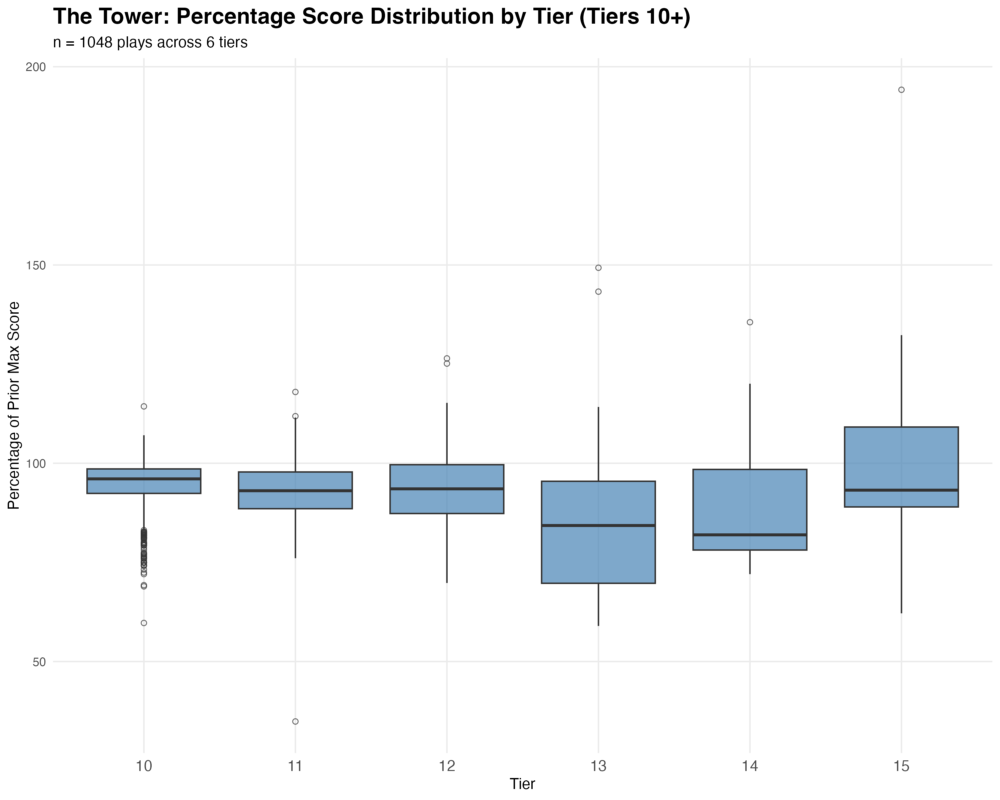
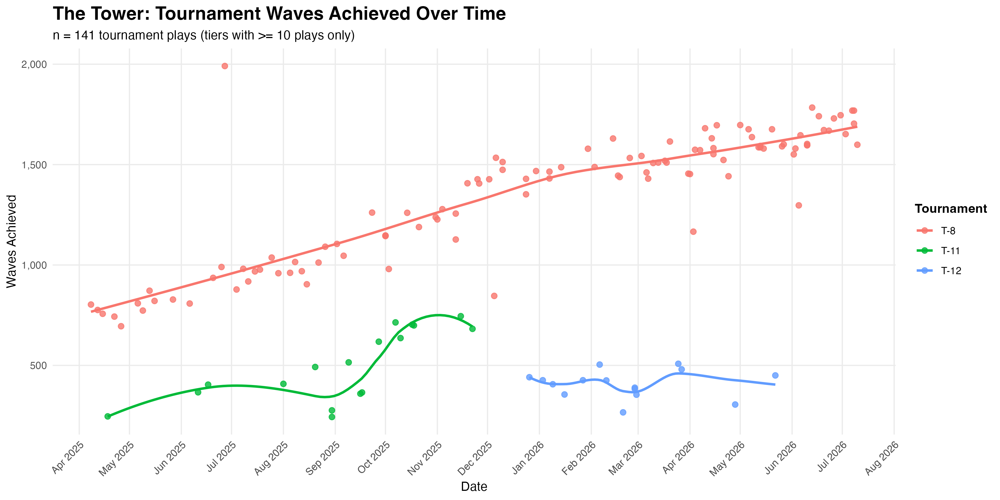
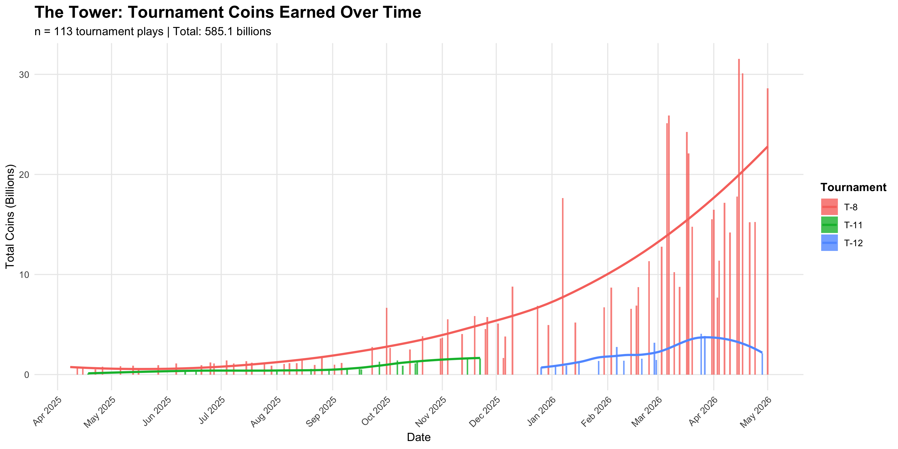
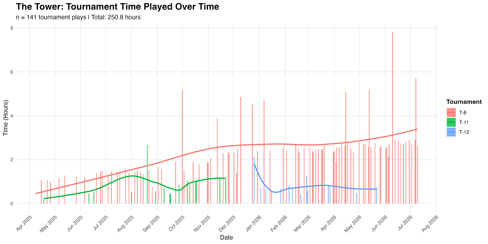

# The Tower

This is a game that baffles everyone who sees me playing it. I'm sure they'd
be even more baffled to discover I've been tracking my matches to discern any
signs of progress. I was able to gain some insights from this spreadsheet
itself, but I knew I wanted to eventually generate some scatter plots and
trend lines. Here it is.

## Links about the game

- [The Tower on the Google Play store](https://play.google.com/store/apps/details?id=com.TechTreeGames.TheTower&hl=en_US)
- [The Tower on the Apple App Store](https://apps.apple.com/us/app/the-tower-idle-tower-defense/id1575590830)
- [Notion wiki for The Tower](https://the-tower.notion.site/)
- [Tech Tree Games](https://www.techtreegames.com/) build a variety of idle games.

## Recent Statistics

The tables in this section are generated by `analyze-playlog.R` and reflect
the latest data that I've entered into the spreadsheet and then imported into
this repo.

<!-- RECENT-STATS-START -->

<!-- Auto-generated by analyze-playlog.R — do not edit between these markers -->

### Recent Statistics (Feb 2026 – Jun 2026)

| Tier | Games | Total Coins (B) | Avg Duration | Max Duration | Avg Coins (B) | Max Coins (B) | Avg Min/B | Avg Coins/Hr |
| ----- | ------: | --------------: | -----------: | -----------: | --------------: | --------------: | ----------: | -------------: |
| 15 | 9 | 21.2 | 0h18m | 0h21m | 2.4 | 4.2 | 8.7 | 7.8 |
| 14 | 23 | 111.7 | 0h40m | 0h48m | 4.9 | 14.9 | 9.8 | 7.1 |
| 13 | 65 | 1,039.4 | 1h35m | 2h26m | 16.0 | 51.4 | 8.4 | 9.5 |
| 12 | 61 | 3,668.7 | 3h56m | 10h41m | 60.1 | 195.4 | 6.0 | 14.5 |
| 11 | 26 | 12,806.3 | 7h24m | 10h41m | 492.6 | 1222.2 | 1.9 | 63.2 |
| 10 | 192 | 103,455.0 | 8h54m | 14h28m | 538.8 | 1891.5 | 2.1 | 57.1 |
| 9 | 19 | 20,532.7 | 10h28m | 10h53m | 1080.7 | 1933.4 | 0.8 | 101.9 |
| 8 | 3 | 4,387.3 | 11h32m | 11h41m | 1462.4 | 1919.7 | 0.5 | 126.6 |
| 7 | 1 | 2,397.0 | 12h57m | 12h57m | 2397.0 | 2397.0 | 0.3 | 185.2 |
| 6 | 1 | 3,450.0 | 15h02m | 15h02m | 3450.0 | 3450.0 | 0.3 | 229.6 |
| **All** | **400** | **151,869.4** | **6h19m** | **15h02m** | **379.7** | **3450.0** | **4.2** | **42.7** |

<!-- RECENT-STATS-END -->

<!-- RECENT-TOURNAMENT-STATS-START -->

<!-- Auto-generated by analyze-playlog.R — do not edit between these markers -->

### Recent Tournament Statistics (Dec 2025 – Jun 2026)

| Tier | Games | Total Coins (B) | Avg Duration | Max Duration | Avg Coins (B) | Max Coins (B) | Avg Wave | Max Wave |
| ----- | ------: | --------------: | -----------: | -----------: | --------------: | --------------: | ------: | ------: |
| T-12 | 15 | 29.5 | 0h45m | 2h07m | 2.0 | 4.1 | 408 | 508 |
| T-8 | 56 | 944.9 | 2h30m | 2h54m | 16.9 | 45.9 | 1528 | 1784 |
| **All** | **71** | **974.3** | **2h08m** | **2h54m** | **13.7** | **45.9** | **1292** | **1784** |

<!-- RECENT-TOURNAMENT-STATS-END -->

## Regular Plays Analysis

Graphs generated from playlog data:

### Tournament Analysis

Tournaments are special events tracked as negative tier numbers. Analysis only includes tiers with 10+ plays.

