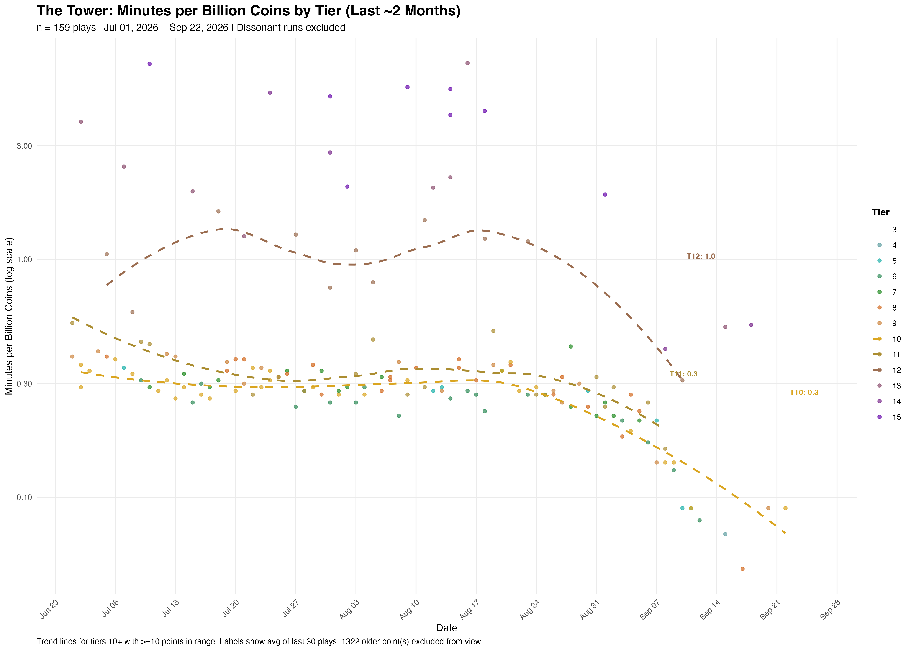

# The Tower

This is a game that baffles everyone who sees me playing it. I'm sure they'd
be even more baffled to discover I've been tracking my matches to discern any
signs of progress. I was able to gain some insights from this spreadsheet
itself, but I knew I wanted to eventually generate some scatter plots and
trend lines. Here it is.

## Links about the game

- [The Tower on the Google Play store](https://play.google.com/store/apps/details?id=com.TechTreeGames.TheTower&hl=en_US)
- [The Tower on the Apple App Store](https://apps.apple.com/us/app/the-tower-idle-tower-defense/id1575590830)
- [Notion wiki for The Tower](https://the-tower.notion.site/)
- [Tech Tree Games](https://www.techtreegames.com/) build a variety of idle games.

## Recent Statistics

The tables in this section are generated by `analyze-playlog.R` and reflect
the latest data that I've entered into the spreadsheet and then imported into
this repo.

<!-- RECENT-STATS-START -->

<!-- Auto-generated by analyze-playlog.R — do not edit between these markers -->

### Recent Statistics (Apr 2026 – Aug 2026)

| Tier | Games | Total Coins (B) | Avg Duration | Max Duration | Avg Coins (B) | Max Coins (B) | Avg Min/B | Avg Coins/Hr |
| ----- | ------: | --------------: | -----------: | -----------: | --------------: | --------------: | ----------: | -------------: |
| 15 | 15 | 55.3 | 0h18m | 0h26m | 3.7 | 13.1 | 6.15 | 11.5 |
| 14 | 13 | 114.9 | 0h44m | 0h57m | 8.8 | 20.4 | 6.49 | 11.5 |
| 13 | 47 | 1,448.8 | 1h51m | 2h48m | 30.8 | 134.5 | 4.71 | 15.6 |
| 12 | 33 | 5,483.9 | 4h28m | 6h11m | 166.2 | 474.5 | 2.33 | 35.6 |
| 11 | 30 | 31,675.6 | 8h02m | 10h41m | 1055.9 | 1876.2 | 0.59 | 130.5 |
| 10 | 120 | 155,408.6 | 9h39m | 10h17m | 1295.1 | 2307.3 | 0.75 | 131.5 |
| 9 | 35 | 54,601.4 | 10h51m | 11h47m | 1560.0 | 2518.7 | 0.49 | 142.7 |
| 8 | 23 | 46,533.3 | 11h49m | 12h06m | 2023.2 | 2654.6 | 0.36 | 171.0 |
| 7 | 14 | 35,594.1 | 13h04m | 13h30m | 2542.4 | 3320.0 | 0.31 | 194.1 |
| 6 | 15 | 52,730.0 | 15h23m | 15h39m | 3515.3 | 4080.0 | 0.26 | 228.4 |
| 5 | 4 | 13,577.8 | 16h44m | 17h16m | 3394.4 | 3670.0 | 0.30 | 202.6 |
| **All** | **349** | **397,223.6** | **7h58m** | **17h16m** | **1138.2** | **4080.0** | **1.77** | **108.3** |

<!-- RECENT-STATS-END -->

<!-- RECENT-TOURNAMENT-STATS-START -->

<!-- Auto-generated by analyze-playlog.R — do not edit between these markers -->

### Recent Tournament Statistics (Feb 2026 – Aug 2026)

| Tier | Games | Total Coins (B) | Avg Duration | Max Duration | Avg Coins (B) | Max Coins (B) | Avg Wave | Max Wave |
| ----- | ------: | --------------: | -----------: | -----------: | --------------: | --------------: | ------: | ------: |
| T-12 | 10 | 24.3 | 0h40m | 0h50m | 2.4 | 4.1 | 406 | 508 |
| T-8 | 69 | 2,134.1 | 2h38m | 2h59m | 30.9 | 130.6 | 1612 | 1830 |
| **All** | **79** | **2,158.4** | **2h23m** | **2h59m** | **27.3** | **130.6** | **1459** | **1830** |

<!-- RECENT-TOURNAMENT-STATS-END -->

## Regular Plays Analysis

Graphs generated from playlog data:

## Tournament Analysis

Tournaments are special events tracked as negative tier numbers. Analysis only includes tiers with 10+ plays.

## Dissonant Run Analysis

The table below is generated by `analyze-playlog.R` and shows the latest
dissonant run per tier and category. `Pct of Max` is the finish wave as a
percentage of the max wave for that tier, and `Days Since` is how long it
has been since that run was done.

<!-- RECENT-DISSONANT-STATS-START -->

<!-- Auto-generated by analyze-playlog.R — do not edit between these markers -->

### Recent Dissonant Run Statistics (as of 2026-08-30)

Latest dissonant run per tier and category. `Pct of Max` = Finish Wave / Max Wave for that tier.

| Tier | Category | Last Run | Finish Wave | Max Wave | Pct of Max | Days Since |
| ----- | -------- | -------- | ----------: | -------: | ---------: | ---------: |
| 14 | Attack | 2026-04-20 | 104 | 493 | 21.1% | 132 |
| 14 | Defense | 2026-04-13 | 34 | 493 | 6.9% | 139 |
| 14 | Utility | 2026-04-20 | 226 | 493 | 45.8% | 132 |
| 14 | Ultimate Weapons | 2026-04-13 | 298 | 493 | 60.4% | 139 |
| 13 | Attack | 2026-04-20 | 315 | 1460 | 21.6% | 132 |
| 13 | Defense | 2026-04-11 | 153 | 1460 | 10.5% | 141 |
| 13 | Utility | 2026-04-10 | 611 | 1460 | 41.8% | 142 |
| 13 | Ultimate Weapons | 2026-04-10 | 581 | 1460 | 39.8% | 142 |
| 12 | Attack | 2026-05-18 | 798 | 3118 | 25.6% | 104 |
| 12 | Defense | 2026-05-18 | 720 | 3118 | 23.1% | 104 |
| 12 | Utility | 2026-05-18 | 1828 | 3118 | 58.6% | 104 |
| 12 | Ultimate Weapons | 2026-05-18 | 1387 | 3118 | 44.5% | 104 |
| 11 | Attack | 2026-04-19 | 4019 | 4940 | 81.4% | 133 |
| 11 | Defense | 2026-05-18 | 1926 | 5321 | 36.2% | 104 |
| 11 | Utility | 2026-05-10 | 3475 | 5185 | 67.0% | 112 |
| 11 | Ultimate Weapons | 2026-07-01 | 3709 | 5392 | 68.8% | 60 |
| 10 | Attack | 2026-05-11 | 5067 | 6453 | 78.5% | 111 |
| 10 | Defense | 2026-04-14 | 2606 | 6010 | 43.4% | 138 |
| 10 | Utility | 2026-04-19 | 4249 | 6414 | 66.2% | 133 |
| 10 | Ultimate Weapons | 2026-05-16 | 4587 | 6540 | 70.1% | 106 |
| 9 | Attack | 2026-04-26 | 5965 | 6437 | 92.7% | 126 |
| 9 | Defense | 2026-04-26 | 2930 | 6437 | 45.5% | 126 |
| 9 | Utility | 2026-04-25 | 4182 | 6437 | 65.0% | 127 |
| 9 | Ultimate Weapons | 2026-06-26 | 5338 | 7393 | 72.2% | 65 |
| 8 | Attack | 2026-05-08 | 6395 | 6136 | 104.2% | 114 |
| 8 | Defense | 2026-05-08 | 2927 | 6136 | 47.7% | 114 |
| 8 | Utility | 2026-05-07 | 4468 | 6136 | 72.8% | 115 |
| 8 | Ultimate Weapons | 2026-05-07 | 5181 | 6136 | 84.4% | 115 |
| 7 | Attack | 2026-06-14 | 7743 | 6096 | 127.0% | 77 |
| 7 | Defense | 2026-06-14 | 3309 | 6096 | 54.3% | 77 |
| 7 | Utility | 2026-06-13 | 5878 | 6096 | 96.4% | 78 |
| 7 | Ultimate Weapons | 2026-06-13 | 6087 | 6096 | 99.9% | 78 |
| 6 | Attack | 2026-06-17 | 9686 | 7173 | 135.0% | 74 |
| 6 | Defense | 2026-06-16 | 4063 | 7173 | 56.6% | 75 |
| 6 | Utility | 2026-06-15 | 5605 | 6344 | 88.4% | 76 |
| 6 | Ultimate Weapons | 2026-06-16 | 7173 | 6344 | 113.1% | 75 |
| 5 | Attack | 2026-07-06 | 10046 | 7862 | 127.8% | 55 |
| 5 | Defense | 2026-07-05 | 4335 | 7862 | 55.1% | 56 |
| 5 | Utility | 2026-07-03 | 6064 | 6378 | 95.1% | 58 |
| 5 | Ultimate Weapons | 2026-07-04 | 7862 | 6378 | 123.3% | 57 |
| **All** | **65 runs** | **2026-07-06** | **10046** | — | **56.2%** | **55** |

<!-- RECENT-DISSONANT-STATS-END -->
