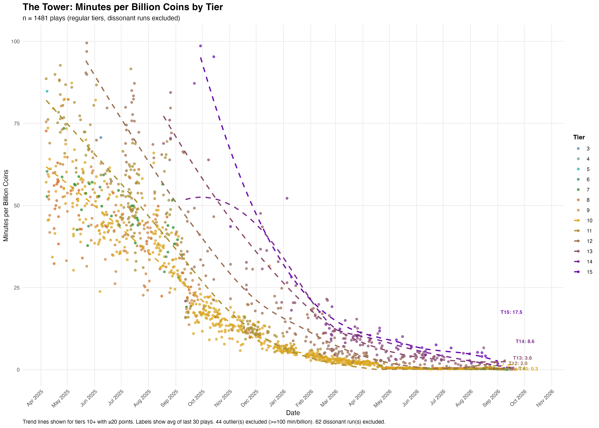
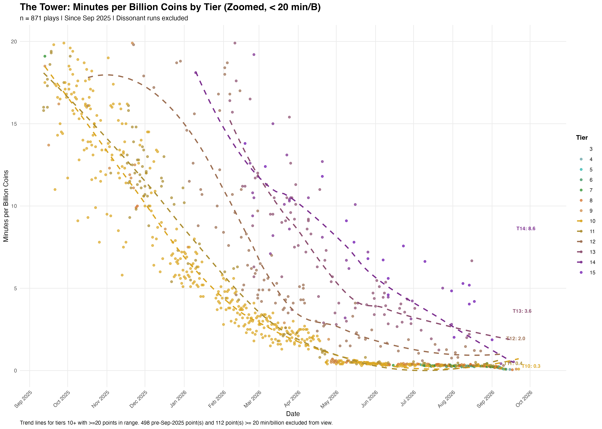
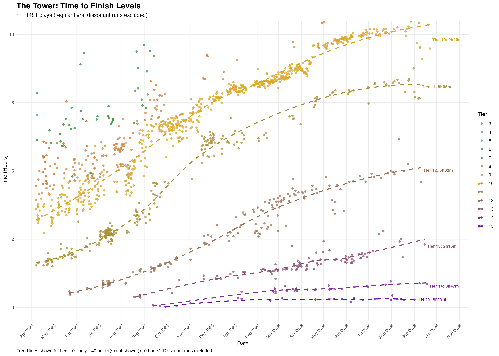
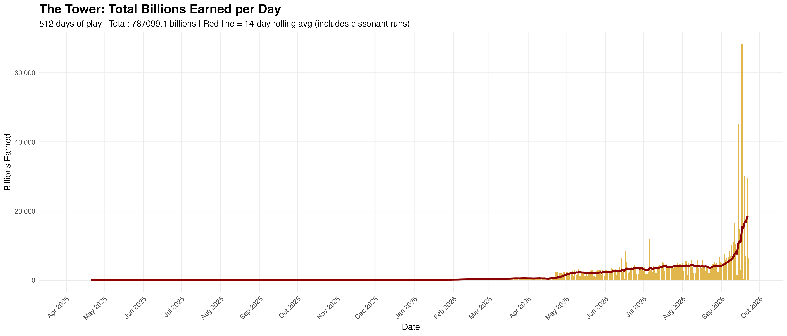
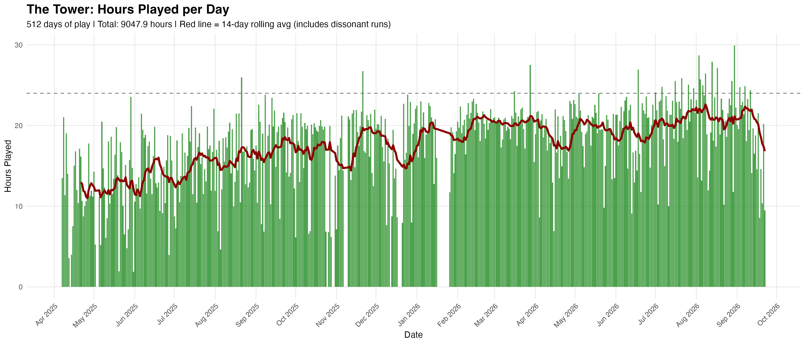
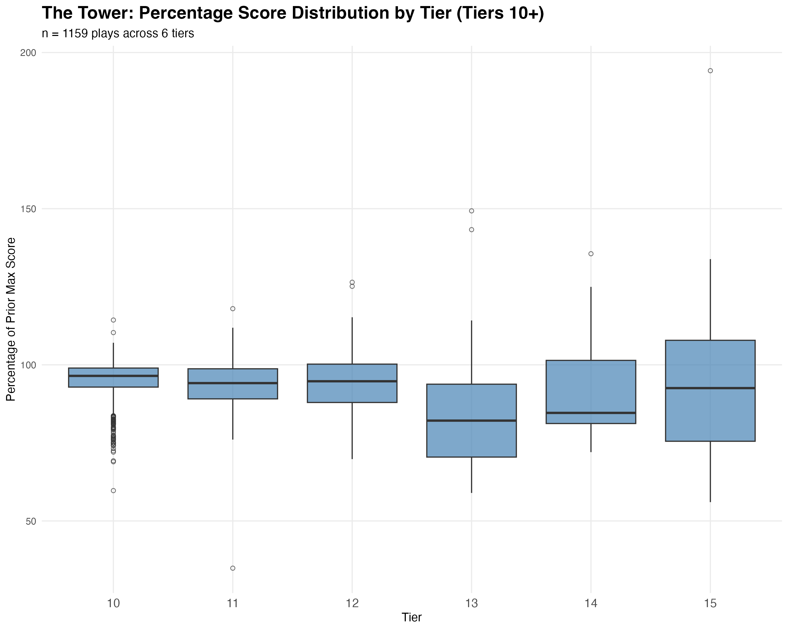
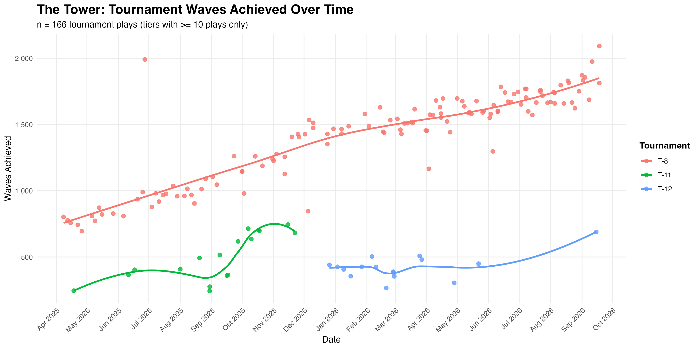
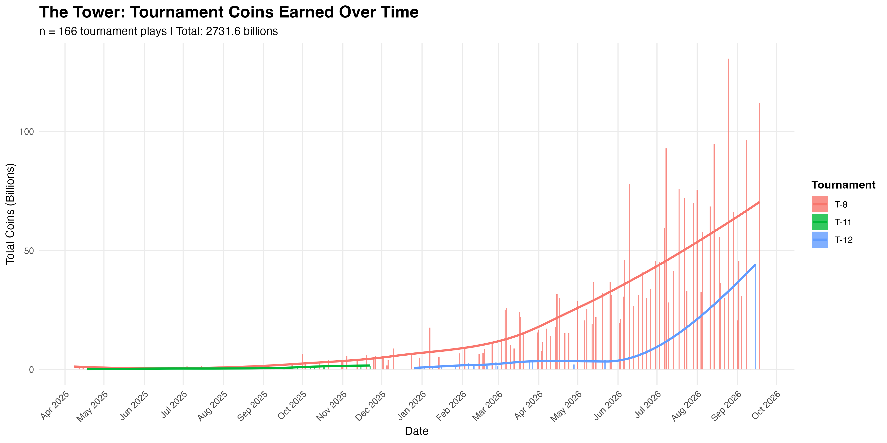
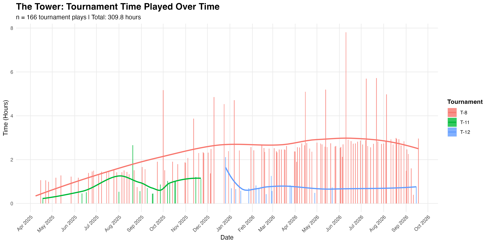

# The Tower

This is a game that baffles everyone who sees me playing it. I'm sure they'd
be even more baffled to discover I've been tracking my matches to discern any
signs of progress. I was able to gain some insights from this spreadsheet
itself, but I knew I wanted to eventually generate some scatter plots and
trend lines. Here it is.

## Links about the game

- [The Tower on the Google Play store](https://play.google.com/store/apps/details?id=com.TechTreeGames.TheTower&hl=en_US)
- [The Tower on the Apple App Store](https://apps.apple.com/us/app/the-tower-idle-tower-defense/id1575590830)
- [Notion wiki for The Tower](https://the-tower.notion.site/)
- [Tech Tree Games](https://www.techtreegames.com/) build a variety of idle games.

## Recent Statistics

The tables in this section are generated by `analyze-playlog.R` and reflect
the latest data that I've entered into the spreadsheet and then imported into
this repo.

<!-- RECENT-STATS-START -->

<!-- Auto-generated by analyze-playlog.R — do not edit between these markers -->

### Recent Statistics (Apr 2026 – Aug 2026)

| Tier | Games | Total Coins (B) | Avg Duration | Max Duration | Avg Coins (B) | Max Coins (B) | Avg Min/B | Avg Coins/Hr |
| ----- | ------: | --------------: | -----------: | -----------: | --------------: | --------------: | ----------: | -------------: |
| 15 | 11 | 40.1 | 0h19m | 0h26m | 3.6 | 13.1 | 6.68 | 10.9 |
| 14 | 13 | 114.9 | 0h44m | 0h57m | 8.8 | 20.4 | 6.49 | 11.5 |
| 13 | 44 | 1,291.8 | 1h49m | 2h48m | 29.4 | 134.5 | 4.78 | 15.2 |
| 12 | 29 | 4,355.9 | 4h21m | 4h59m | 150.2 | 474.5 | 2.50 | 33.1 |
| 11 | 24 | 22,395.2 | 7h58m | 10h41m | 933.1 | 1801.5 | 0.65 | 116.3 |
| 10 | 115 | 145,697.2 | 9h38m | 10h12m | 1266.9 | 2307.3 | 0.77 | 128.9 |
| 9 | 29 | 41,192.4 | 10h47m | 11h17m | 1420.4 | 2222.3 | 0.52 | 130.7 |
| 8 | 13 | 24,402.3 | 11h46m | 12h06m | 1877.1 | 2551.0 | 0.39 | 159.3 |
| 7 | 9 | 22,902.7 | 13h06m | 13h19m | 2544.8 | 2789.5 | 0.31 | 194.1 |
| 6 | 9 | 31,020.0 | 15h26m | 15h39m | 3446.7 | 3830.0 | 0.27 | 223.4 |
| 5 | 1 | 2,817.8 | 16h13m | 16h13m | 2817.8 | 2817.8 | 0.30 | 173.7 |
| **All** | **297** | **296,230.4** | **7h36m** | **16h13m** | **997.4** | **3830.0** | **1.92** | **98.7** |

<!-- RECENT-STATS-END -->

<!-- RECENT-TOURNAMENT-STATS-START -->

<!-- Auto-generated by analyze-playlog.R — do not edit between these markers -->

### Recent Tournament Statistics (Feb 2026 – Aug 2026)

| Tier | Games | Total Coins (B) | Avg Duration | Max Duration | Avg Coins (B) | Max Coins (B) | Avg Wave | Max Wave |
| ----- | ------: | --------------: | -----------: | -----------: | --------------: | --------------: | ------: | ------: |
| T-12 | 10 | 24.3 | 0h40m | 0h50m | 2.4 | 4.1 | 406 | 508 |
| T-8 | 60 | 1,627.9 | 2h36m | 2h54m | 27.1 | 75.8 | 1595 | 1784 |
| **All** | **70** | **1,652.2** | **2h20m** | **2h54m** | **23.6** | **75.8** | **1425** | **1784** |

<!-- RECENT-TOURNAMENT-STATS-END -->

## Regular Plays Analysis

Graphs generated from playlog data:

## Tournament Analysis

Tournaments are special events tracked as negative tier numbers. Analysis only includes tiers with 10+ plays.

## Dissonant Run Analysis

The table below is generated by `analyze-playlog.R` and shows the latest
dissonant run per tier and category. `Pct of Max` is the finish wave as a
percentage of the max wave for that tier, and `Days Since` is how long it
has been since that run was done.

<!-- RECENT-DISSONANT-STATS-START -->

<!-- Auto-generated by analyze-playlog.R — do not edit between these markers -->

### Recent Dissonant Run Statistics (as of 2026-08-04)

Latest dissonant run per tier and category. `Pct of Max` = Finish Wave / Max Wave for that tier.

| Tier | Category | Last Run | Finish Wave | Max Wave | Pct of Max | Days Since |
| ----- | -------- | -------- | ----------: | -------: | ---------: | ---------: |
| 14 | Attack | 2026-04-20 | 104 | 493 | 21.1% | 106 |
| 14 | Defense | 2026-04-13 | 34 | 493 | 6.9% | 113 |
| 14 | Utility | 2026-04-20 | 226 | 493 | 45.8% | 106 |
| 14 | Ultimate Weapons | 2026-04-13 | 298 | 493 | 60.4% | 113 |
| 13 | Attack | 2026-04-20 | 315 | 1460 | 21.6% | 106 |
| 13 | Defense | 2026-04-11 | 153 | 1460 | 10.5% | 115 |
| 13 | Utility | 2026-04-10 | 611 | 1460 | 41.8% | 116 |
| 13 | Ultimate Weapons | 2026-04-10 | 581 | 1460 | 39.8% | 116 |
| 12 | Attack | 2026-05-18 | 798 | 3118 | 25.6% | 78 |
| 12 | Defense | 2026-05-18 | 720 | 3118 | 23.1% | 78 |
| 12 | Utility | 2026-05-18 | 1828 | 3118 | 58.6% | 78 |
| 12 | Ultimate Weapons | 2026-05-18 | 1387 | 3118 | 44.5% | 78 |
| 11 | Attack | 2026-04-19 | 4019 | 4940 | 81.4% | 107 |
| 11 | Defense | 2026-05-18 | 1926 | 5321 | 36.2% | 78 |
| 11 | Utility | 2026-05-10 | 3475 | 5185 | 67.0% | 86 |
| 11 | Ultimate Weapons | 2026-07-01 | 3709 | 5392 | 68.8% | 34 |
| 10 | Attack | 2026-05-11 | 5067 | 6453 | 78.5% | 85 |
| 10 | Defense | 2026-04-14 | 2606 | 6010 | 43.4% | 112 |
| 10 | Utility | 2026-04-19 | 4249 | 6414 | 66.2% | 107 |
| 10 | Ultimate Weapons | 2026-05-16 | 4587 | 6540 | 70.1% | 80 |
| 9 | Attack | 2026-04-26 | 5965 | 6437 | 92.7% | 100 |
| 9 | Defense | 2026-04-26 | 2930 | 6437 | 45.5% | 100 |
| 9 | Utility | 2026-04-25 | 4182 | 6437 | 65.0% | 101 |
| 9 | Ultimate Weapons | 2026-06-26 | 5338 | 7393 | 72.2% | 39 |
| 8 | Attack | 2026-05-08 | 6395 | 6136 | 104.2% | 88 |
| 8 | Defense | 2026-05-08 | 2927 | 6136 | 47.7% | 88 |
| 8 | Utility | 2026-05-07 | 4468 | 6136 | 72.8% | 89 |
| 8 | Ultimate Weapons | 2026-05-07 | 5181 | 6136 | 84.4% | 89 |
| 7 | Attack | 2026-06-14 | 7743 | 6096 | 127.0% | 51 |
| 7 | Defense | 2026-06-14 | 3309 | 6096 | 54.3% | 51 |
| 7 | Utility | 2026-06-13 | 5878 | 6096 | 96.4% | 52 |
| 7 | Ultimate Weapons | 2026-06-13 | 6087 | 6096 | 99.9% | 52 |
| 6 | Attack | 2026-06-17 | 9686 | 7173 | 135.0% | 48 |
| 6 | Defense | 2026-06-16 | 4063 | 7173 | 56.6% | 49 |
| 6 | Utility | 2026-06-15 | 5605 | 6344 | 88.4% | 50 |
| 6 | Ultimate Weapons | 2026-06-16 | 7173 | 6344 | 113.1% | 49 |
| 5 | Attack | 2026-07-06 | 10046 | 7862 | 127.8% | 29 |
| 5 | Defense | 2026-07-05 | 4335 | 7862 | 55.1% | 30 |
| 5 | Utility | 2026-07-03 | 6064 | 6378 | 95.1% | 32 |
| 5 | Ultimate Weapons | 2026-07-04 | 7862 | 6378 | 123.3% | 31 |
| **All** | **65 runs** | **2026-07-06** | **10046** | — | **56.2%** | **29** |

<!-- RECENT-DISSONANT-STATS-END -->
