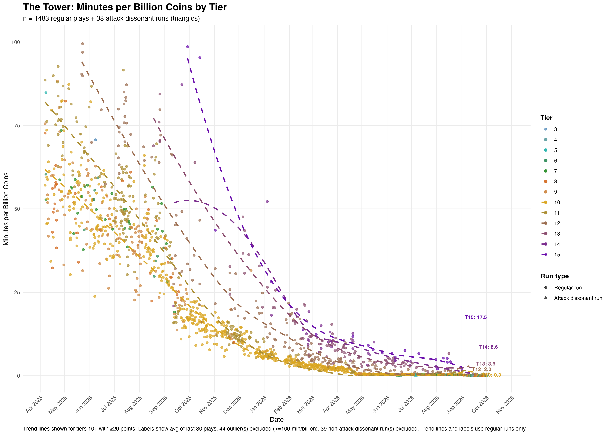
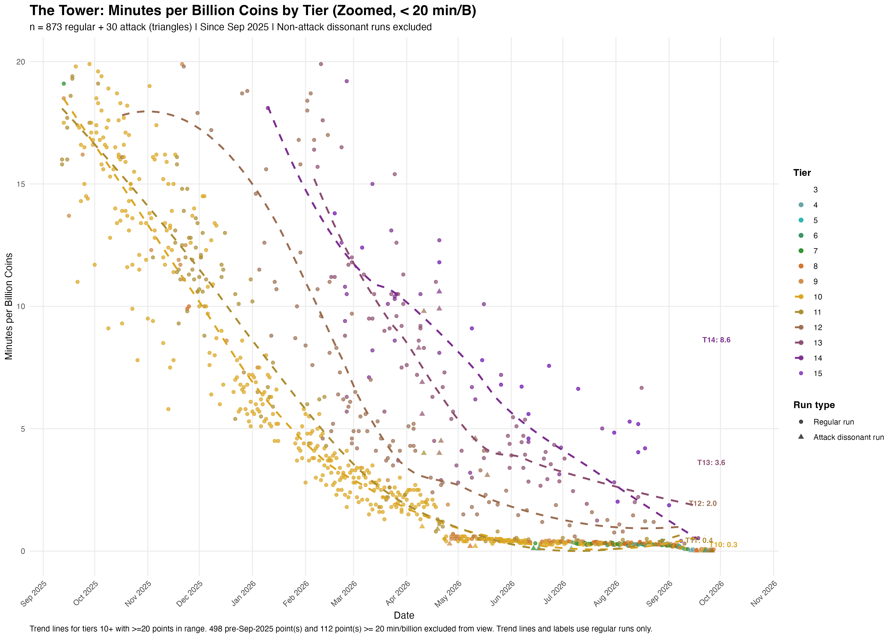
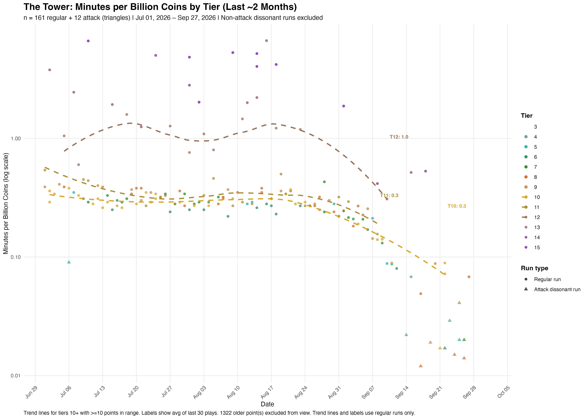
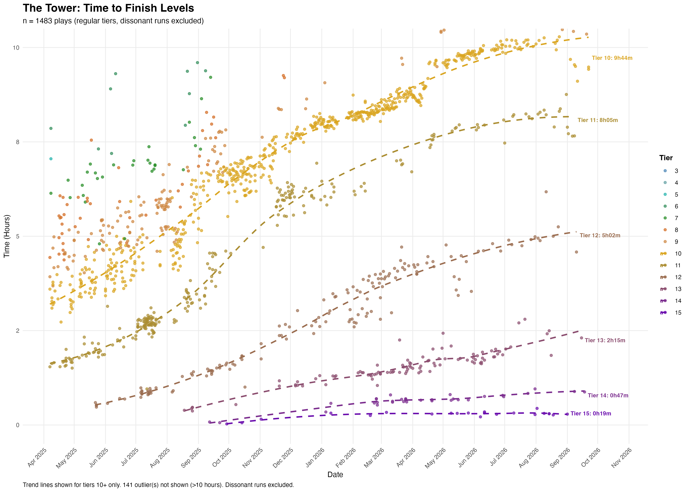
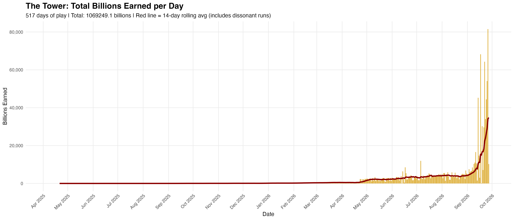
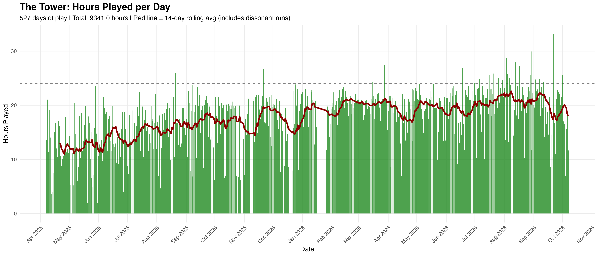
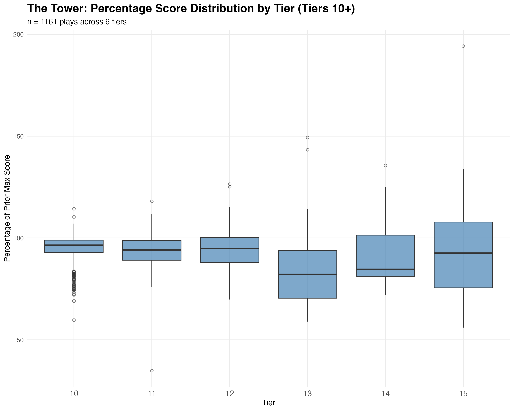
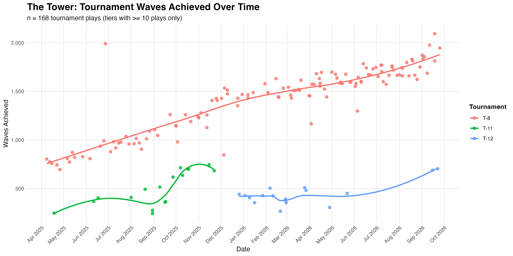
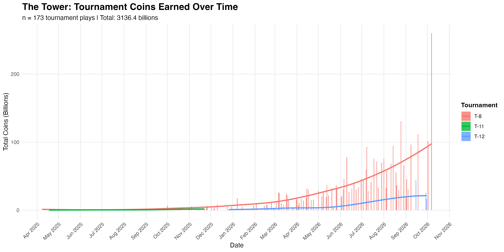
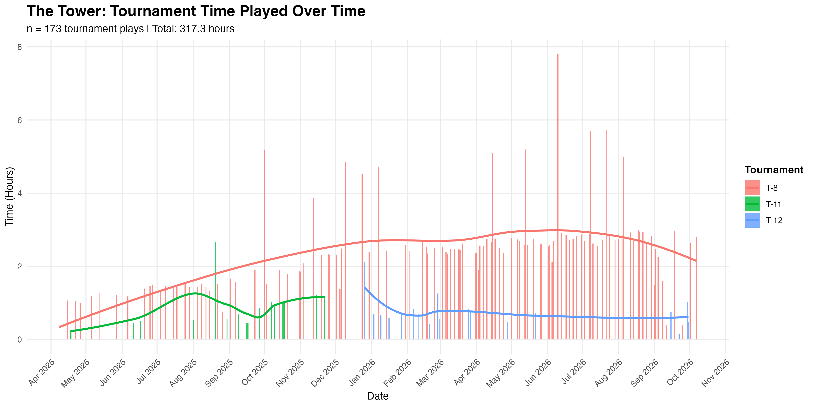

# The Tower

This is a game that baffles everyone who sees me playing it. I'm sure they'd
be even more baffled to discover I've been tracking my matches to discern any
signs of progress. I was able to gain some insights from this spreadsheet
itself, but I knew I wanted to eventually generate some scatter plots and
trend lines. Here it is.

## Links about the game

- [The Tower on the Google Play store](https://play.google.com/store/apps/details?id=com.TechTreeGames.TheTower&hl=en_US)
- [The Tower on the Apple App Store](https://apps.apple.com/us/app/the-tower-idle-tower-defense/id1575590830)
- [Notion wiki for The Tower](https://the-tower.notion.site/)
- [Tech Tree Games](https://www.techtreegames.com/) build a variety of idle games.

## Recent Statistics

The tables in this section are generated by `analyze-playlog.R` and reflect
the latest data that I've entered into the spreadsheet and then imported into
this repo.

<!-- RECENT-STATS-START -->

<!-- Auto-generated by analyze-playlog.R — do not edit between these markers -->

### Recent Statistics (May 2026 – Sep 2026)

| Tier | Games | Total Coins (B) | Avg Duration | Max Duration | Avg Coins (B) | Max Coins (B) | Avg Min/B | Avg Coins/Hr |
| ----- | ------: | --------------: | -----------: | -----------: | --------------: | --------------: | ----------: | -------------: |
| 15 | 15 | 63.0 | 0h18m | 0h26m | 4.2 | 13.1 | 5.48 | 13.3 |
| 14 | 12 | 330.5 | 0h47m | 0h57m | 27.5 | 128.1 | 4.50 | 32.4 |
| 13 | 33 | 1,463.6 | 1h57m | 2h48m | 44.4 | 268.1 | 3.59 | 21.3 |
| 12 | 24 | 5,671.0 | 4h35m | 6h11m | 236.3 | 891.9 | 1.60 | 50.2 |
| 11 | 28 | 38,661.7 | 8h08m | 10h41m | 1380.8 | 2939.8 | 0.39 | 170.9 |
| 10 | 96 | 175,303.3 | 9h52m | 10h17m | 1826.1 | 7800.0 | 0.37 | 185.9 |
| 9 | 28 | 56,947.1 | 10h57m | 11h47m | 2033.8 | 7100.0 | 0.38 | 186.8 |
| 8 | 29 | 82,730.4 | 11h47m | 12h51m | 2852.8 | 13350.0 | 0.32 | 244.9 |
| 7 | 18 | 48,903.0 | 12h54m | 13h30m | 2716.8 | 3610.0 | 0.29 | 211.0 |
| 6 | 19 | 78,400.0 | 15h04m | 15h39m | 4126.3 | 10590.0 | 0.24 | 277.6 |
| 5 | 7 | 38,297.8 | 15h56m | 17h16m | 5471.1 | 10480.0 | 0.23 | 351.9 |
| 4 | 1 | 14,480.0 | 16h29m | 16h29m | 14480.0 | 14480.0 | 0.07 | 878.8 |
| **All** | **310** | **541,251.6** | **8h34m** | **17h16m** | **1746.0** | **14480.0** | **1.20** | **160.9** |

<!-- RECENT-STATS-END -->

<!-- RECENT-TOURNAMENT-STATS-START -->

<!-- Auto-generated by analyze-playlog.R — do not edit between these markers -->

### Recent Tournament Statistics (Mar 2026 – Sep 2026)

| Tier | Games | Total Coins (B) | Avg Duration | Max Duration | Avg Coins (B) | Max Coins (B) | Avg Wave | Max Wave |
| ----- | ------: | --------------: | -----------: | -----------: | --------------: | --------------: | ------: | ------: |
| T-12 | 6 | 58.4 | 0h37m | 0h50m | 9.7 | 44.2 | 522 | 703 |
| T-8 | 73 | 2,464.1 | 2h31m | 2h59m | 33.8 | 130.6 | 1651 | 2092 |
| **All** | **79** | **2,522.4** | **2h22m** | **2h59m** | **31.9** | **130.6** | **1565** | **2092** |

<!-- RECENT-TOURNAMENT-STATS-END -->

## Regular Plays Analysis

Graphs generated from playlog data:

## Tournament Analysis

Tournaments are special events tracked as negative tier numbers. Analysis only includes tiers with 10+ plays.

## Dissonant Run Analysis

The table below is generated by `analyze-playlog.R` and shows the latest
dissonant run per tier and category. `Pct of Max` is the finish wave as a
percentage of the max wave for that tier, and `Days Since` is how long it
has been since that run was done.

<!-- RECENT-DISSONANT-STATS-START -->

<!-- Auto-generated by analyze-playlog.R — do not edit between these markers -->

### Recent Dissonant Run Statistics (as of 2026-09-27)

Latest dissonant run per tier and category. `Pct of Max` = Finish Wave / Max Wave for that tier.

| Tier | Category | Last Run | Finish Wave | Max Wave | Pct of Max | Days Since |
| ----- | -------- | -------- | ----------: | -------: | ---------: | ---------: |
| 14 | Attack | 2026-04-20 | 104 | 493 | 21.1% | 160 |
| 14 | Defense | 2026-04-13 | 34 | 493 | 6.9% | 167 |
| 14 | Utility | 2026-04-20 | 226 | 493 | 45.8% | 160 |
| 14 | Ultimate Weapons | 2026-04-13 | 298 | 493 | 60.4% | 167 |
| 13 | Attack | 2026-04-20 | 315 | 1460 | 21.6% | 160 |
| 13 | Defense | 2026-04-11 | 153 | 1460 | 10.5% | 169 |
| 13 | Utility | 2026-04-10 | 611 | 1460 | 41.8% | 170 |
| 13 | Ultimate Weapons | 2026-04-10 | 581 | 1460 | 39.8% | 170 |
| 12 | Attack | 2026-05-18 | 798 | 3118 | 25.6% | 132 |
| 12 | Defense | 2026-05-18 | 720 | 3118 | 23.1% | 132 |
| 12 | Utility | 2026-05-18 | 1828 | 3118 | 58.6% | 132 |
| 12 | Ultimate Weapons | 2026-05-18 | 1387 | 3118 | 44.5% | 132 |
| 11 | Attack | 2026-09-25 | 4548 | 6187 | 73.5% | 2 |
| 11 | Defense | 2026-05-18 | 1926 | 5321 | 36.2% | 132 |
| 11 | Utility | 2026-05-10 | 3475 | 5185 | 67.0% | 140 |
| 11 | Ultimate Weapons | 2026-07-01 | 3709 | 5392 | 68.8% | 88 |
| 10 | Attack | 2026-09-21 | 6174 | 7569 | 81.6% | 6 |
| 10 | Defense | 2026-09-21 | 4172 | 7569 | 55.1% | 6 |
| 10 | Utility | 2026-09-20 | 4855 | 7569 | 64.1% | 7 |
| 10 | Ultimate Weapons | 2026-09-21 | 5464 | 7569 | 72.2% | 6 |
| 9 | Attack | 2026-09-19 | 7045 | 8160 | 86.3% | 8 |
| 9 | Defense | 2026-09-19 | 4414 | 8160 | 54.1% | 8 |
| 9 | Utility | 2026-09-18 | 5200 | 8160 | 63.7% | 9 |
| 9 | Ultimate Weapons | 2026-09-18 | 6056 | 8160 | 74.2% | 9 |
| 8 | Attack | 2026-09-26 | 8478 | 8788 | 96.5% | 1 |
| 8 | Defense | 2026-09-16 | 4804 | 8788 | 54.7% | 11 |
| 8 | Utility | 2026-09-15 | 5320 | 8788 | 60.5% | 12 |
| 8 | Ultimate Weapons | 2026-09-16 | 6643 | 8788 | 75.6% | 11 |
| 7 | Attack | 2026-09-26 | 9419 | 9450 | 99.7% | 1 |
| 7 | Defense | 2026-06-14 | 3309 | 6096 | 54.3% | 105 |
| 7 | Utility | 2026-06-13 | 5878 | 6096 | 96.4% | 106 |
| 7 | Ultimate Weapons | 2026-06-13 | 6087 | 6096 | 99.9% | 106 |
| 6 | Attack | 2026-09-22 | 11246 | 11106 | 101.3% | 5 |
| 6 | Defense | 2026-06-16 | 4063 | 7173 | 56.6% | 103 |
| 6 | Utility | 2026-06-15 | 5605 | 6344 | 88.4% | 104 |
| 6 | Ultimate Weapons | 2026-06-16 | 7173 | 6344 | 113.1% | 103 |
| 5 | Attack | 2026-09-25 | 12077 | 11955 | 101.0% | 2 |
| 5 | Defense | 2026-07-05 | 4335 | 7862 | 55.1% | 84 |
| 5 | Utility | 2026-07-03 | 6064 | 6378 | 95.1% | 86 |
| 5 | Ultimate Weapons | 2026-07-04 | 7862 | 6378 | 123.3% | 85 |
| 4 | Attack | 2026-09-23 | 13035 | 13010 | 100.2% | 4 |
| 4 | Defense | 2026-09-13 | 4644 | 10003 | 46.4% | 14 |
| 4 | Utility | 2026-09-12 | 6890 | 6459 | 106.7% | 15 |
| 4 | Ultimate Weapons | 2026-09-13 | 10003 | 6890 | 145.2% | 14 |
| **All** | **88 runs** | **2026-09-26** | **13035** | — | **63.4%** | **1** |

<!-- RECENT-DISSONANT-STATS-END -->
