# The Tower

This is a game that baffles everyone who sees me playing it. I'm sure they'd
be even more baffled to discover I've been tracking my matches to discern any
signs of progress. I was able to gain some insights from this spreadsheet
itself, but I knew I wanted to eventually generate some scatter plots and
trend lines. Here it is.

## Links about the game

- [The Tower on the Google Play store](https://play.google.com/store/apps/details?id=com.TechTreeGames.TheTower&hl=en_US)
- [The Tower on the Apple App Store](https://apps.apple.com/us/app/the-tower-idle-tower-defense/id1575590830)
- [Notion wiki for The Tower](https://the-tower.notion.site/)
- [Tech Tree Games](https://www.techtreegames.com/) build a variety of idle games.

## Recent Statistics

The tables in this section are generated by `analyze-playlog.R` and reflect
the latest data that I've entered into the spreadsheet and then imported into
this repo.

Each tier gets a `Regular` row, plus an `Attack` row right below it when I
did attack dissonant runs at that tier during the window. The other
dissonant categories (Defense, Utility, Ultimate Weapons) wreck coin income
on purpose, so they stay out of this table and show up in the dissonant
table further down instead.

<!-- RECENT-STATS-START -->

<!-- Auto-generated by analyze-playlog.R — do not edit between these markers -->

### Recent Statistics (Jul 2026 – Nov 2026)

| Tier | Run | Games | Total Coins (B) | Avg Duration | Max Duration | Avg Coins (B) | Max Coins (B) | Avg Min/B | Avg Coins/Hr |
| ----- | ------- | ------: | --------------: | -----------: | -----------: | --------------: | --------------: | ----------: | -------------: |
| 16 | Regular | 10 | 871.1 | 0h09m | 0h15m | 87.1 | 154.6 | 0.15 | 577.7 |
| 15 | Regular | 13 | 1,101.0 | 0h22m | 0h32m | 84.7 | 398.6 | 2.69 | 179.7 |
| 15 | Attack | 6 | 521.6 | 0h10m | 0h12m | 86.9 | 140.1 | 0.15 | 490.1 |
| 14 | Regular | 9 | 11,713.3 | 1h28m | 2h31m | 1301.5 | 4580.0 | 1.02 | 676.8 |
| 13 | Regular | 10 | 13,826.0 | 2h39m | 4h29m | 1382.6 | 11760.0 | 2.10 | 332.2 |
| 13 | Attack | 3 | 1,392.4 | 1h11m | 1h24m | 464.1 | 551.5 | 0.16 | 388.8 |
| 12 | Regular | 14 | 49,356.9 | 5h16m | 8h31m | 3525.5 | 40960.0 | 0.84 | 463.0 |
| 12 | Attack | 5 | 104,170.0 | 4h33m | 5h11m | 20834.0 | 45680.0 | 0.02 | 4354.3 |
| 11 | Regular | 19 | 50,391.2 | 8h06m | 8h45m | 2652.2 | 21630.0 | 0.31 | 325.1 |
| 11 | Attack | 10 | 1,362,840.0 | 8h28m | 11h12m | 136284.0 | 255100.0 | 0.01 | 15135.2 |
| 10 | Regular | 30 | 79,422.1 | 9h58m | 10h17m | 2647.4 | 7800.0 | 0.27 | 269.7 |
| 10 | Attack | 11 | 2,525,340.0 | 11h19m | 12h44m | 229576.4 | 339980.0 | 0.00 | 19292.6 |
| 9 | Regular | 16 | 39,617.4 | 11h03m | 11h47m | 2476.1 | 7100.0 | 0.31 | 227.1 |
| 9 | Attack | 14 | 1,612,890.0 | 10h37m | 11h55m | 115206.4 | 191200.0 | 0.01 | 10412.1 |
| 8 | Regular | 23 | 72,657.1 | 11h50m | 12h51m | 3159.0 | 13350.0 | 0.29 | 271.2 |
| 8 | Attack | 15 | 1,287,450.0 | 11h23m | 15h08m | 85830.0 | 293790.0 | 0.01 | 7160.7 |
| 7 | Regular | 17 | 46,506.0 | 12h54m | 13h30m | 2735.6 | 3610.0 | 0.29 | 212.5 |
| 7 | Attack | 6 | 1,030,840.0 | 14h16m | 14h57m | 171806.7 | 215580.0 | 0.01 | 11762.9 |
| 6 | Regular | 18 | 74,950.0 | 15h04m | 15h39m | 4163.9 | 10590.0 | 0.24 | 280.2 |
| 6 | Attack | 3 | 304,900.0 | 15h41m | 17h50m | 101633.3 | 201860.0 | 0.01 | 6123.2 |
| 5 | Regular | 7 | 38,297.8 | 15h56m | 17h16m | 5471.1 | 10480.0 | 0.23 | 351.9 |
| 5 | Attack | 2 | 55,920.0 | 15h04m | 15h21m | 27960.0 | 45600.0 | 0.05 | 1834.5 |
| 4 | Regular | 1 | 14,480.0 | 16h29m | 16h29m | 14480.0 | 14480.0 | 0.07 | 878.8 |
| 4 | Attack | 2 | 79,300.0 | 16h36m | 16h41m | 39650.0 | 45280.0 | 0.03 | 2390.8 |
| 3 | Attack | 3 | 137,010.0 | 18h11m | 19h34m | 45670.0 | 78690.0 | 0.04 | 2418.6 |
| 2 | Attack | 2 | 68,020.0 | 18h52m | 18h55m | 34010.0 | 50550.0 | 0.04 | 1800.5 |
| 1 | Attack | 2 | 85,980.0 | 19h41m | 19h48m | 42990.0 | 43270.0 | 0.03 | 2183.7 |
| **All** | **Regular** | **187** | **493,190.1** | **8h46m** | **17h16m** | **2637.4** | **40960.0** | **0.61** | **321.6** |
| **All** | **Attack** | **84** | **8,656,574.0** | **10h31m** | **19h48m** | **103054.5** | **339980.0** | **0.03** | **8991.1** |

<!-- RECENT-STATS-END -->

<!-- RECENT-TOURNAMENT-STATS-START -->

<!-- Auto-generated by analyze-playlog.R — do not edit between these markers -->

### Recent Tournament Statistics (May 2026 – Nov 2026)

| Tier | Games | Total Coins (B) | Avg Duration | Max Duration | Avg Coins (B) | Max Coins (B) | Avg Wave | Max Wave |
| ----- | ------: | --------------: | -----------: | -----------: | --------------: | --------------: | ------: | ------: |
| T-12 | 14 | 176.6 | 0h21m | 0h54m | 12.6 | 63.5 | 690 | 893 |
| T-8 | 64 | 3,260.9 | 2h20m | 3h20m | 51.0 | 326.4 | 1775 | 2593 |
| **All** | **78** | **3,437.6** | **1h58m** | **3h20m** | **44.1** | **326.4** | **1580** | **2593** |

<!-- RECENT-TOURNAMENT-STATS-END -->

## Regular Plays Analysis

Graphs generated from playlog data:

Attack dissonant runs appear as triangles. Trend lines and labels use
regular runs only, except on the 2-month graph, which also draws attack
dissonant trend lines (dashed; same tier color as the solid regular ones).

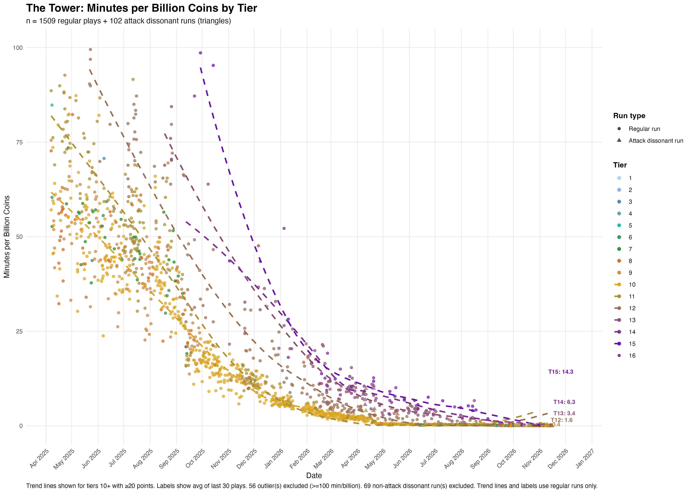

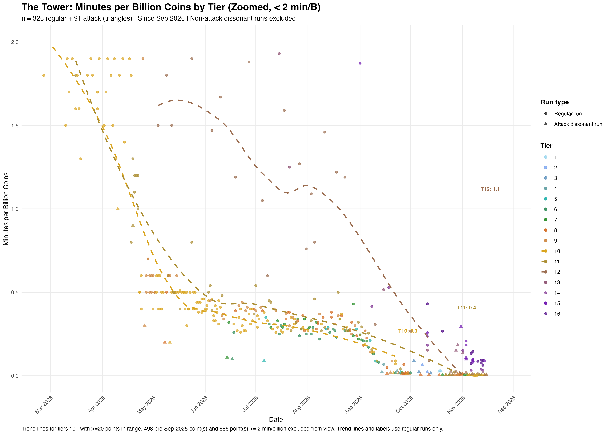

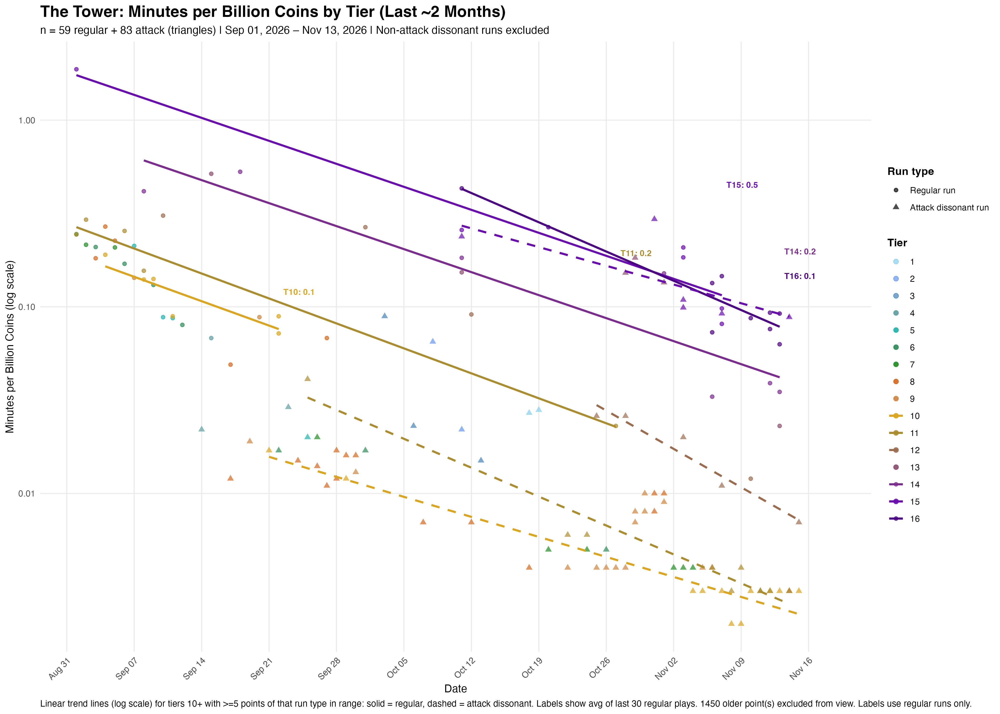

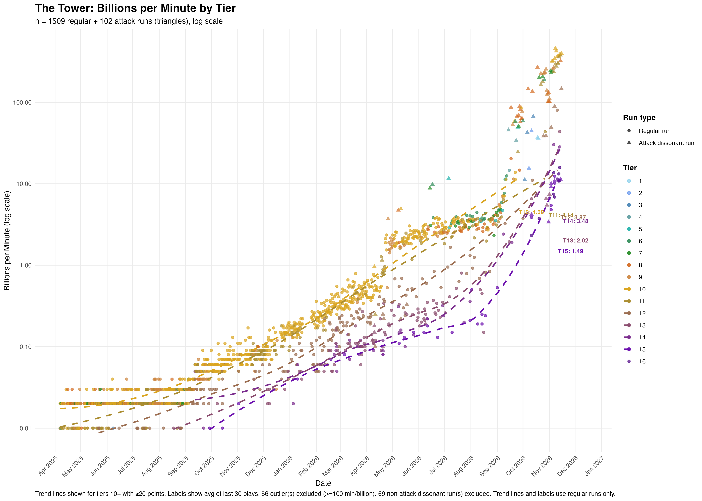

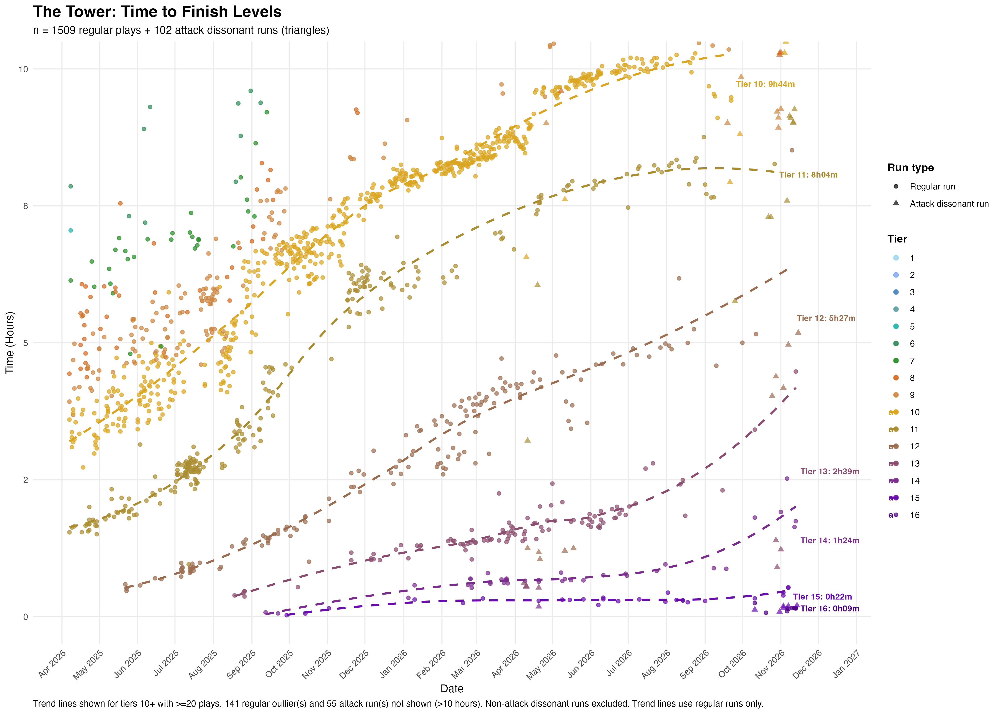

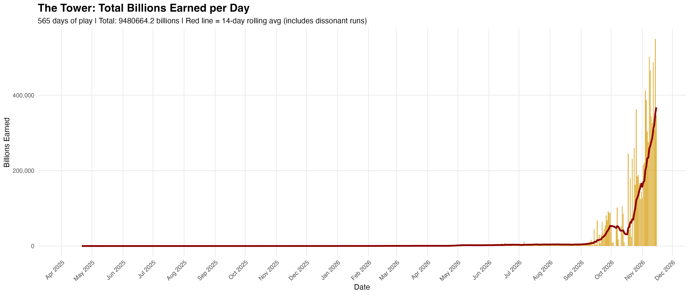

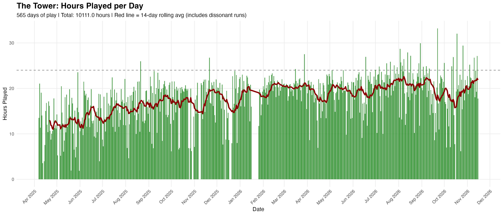

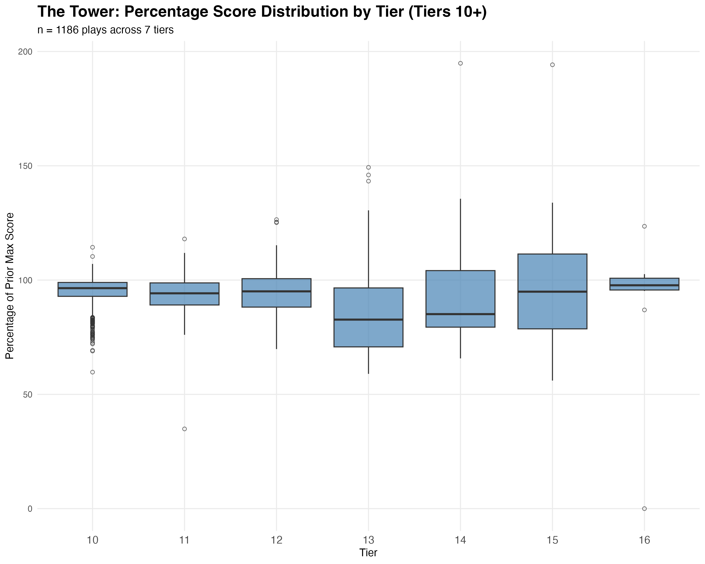

## Tournament Analysis

Tournaments are special events tracked as negative tier numbers. Analysis only includes tiers with 10+ plays.

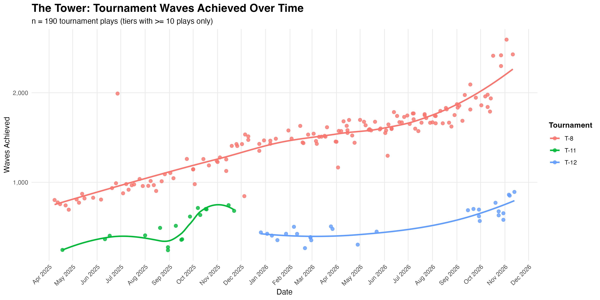

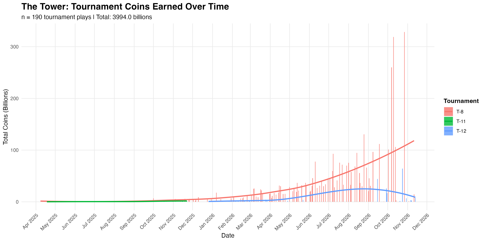

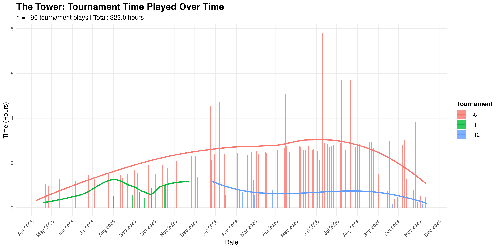

## Dissonant Run Analysis

The table below is generated by `analyze-playlog.R` and shows the latest
dissonant run per tier and category. `Pct of Max` is the finish wave as a
percentage of the max wave for that tier, and `Days Since` is how long it
has been since that run was done.

<!-- RECENT-DISSONANT-STATS-START -->

<!-- Auto-generated by analyze-playlog.R — do not edit between these markers -->

### Recent Dissonant Run Statistics (as of 2026-11-15)

Latest dissonant run per tier and category. `Pct of Max` = Finish Wave / Max Wave for that tier.

| Tier | Category | Last Run | Finish Wave | Max Wave | Pct of Max | Days Since |
| ----- | -------- | -------- | ----------: | -------: | ---------: | ---------: |
| 15 | Attack | 2026-11-14 | 228 | 483 | 47.2% | 1 |
| 15 | Defense | 2026-11-03 | 100 | 375 | 26.7% | 12 |
| 15 | Utility | 2026-11-07 | 357 | 481 | 74.2% | 8 |
| 15 | Ultimate Weapons | 2026-11-07 | 266 | 481 | 55.3% | 8 |
| 14 | Attack | 2026-04-20 | 104 | 493 | 21.1% | 209 |
| 14 | Defense | 2026-10-30 | 205 | 1473 | 13.9% | 16 |
| 14 | Utility | 2026-11-07 | 842 | 2034 | 41.4% | 8 |
| 14 | Ultimate Weapons | 2026-11-07 | 653 | 2034 | 32.1% | 8 |
| 14 | NA | 2026-11-14 | 256 | 2034 | 12.6% | 1 |
| 13 | Attack | 2026-11-01 | 1014 | 2718 | 37.3% | 14 |
| 13 | Defense | 2026-10-20 | 545 | 2718 | 20.1% | 26 |
| 13 | Utility | 2026-11-07 | 1616 | 2718 | 59.5% | 8 |
| 13 | Ultimate Weapons | 2026-11-07 | 1379 | 2718 | 50.7% | 8 |
| 12 | Attack | 2026-11-15 | 4100 | 5108 | 80.3% | 0 |
| 12 | Defense | 2026-10-30 | 1619 | 4074 | 39.7% | 16 |
| 12 | Utility | 2026-11-02 | 2860 | 4074 | 70.2% | 13 |
| 12 | Ultimate Weapons | 2026-11-02 | 3152 | 4074 | 77.4% | 13 |
| 11 | Attack | 2026-11-14 | 7234 | 7271 | 99.5% | 1 |
| 11 | Defense | 2026-10-22 | 3308 | 6187 | 53.5% | 24 |
| 11 | Utility | 2026-10-23 | 4240 | 6187 | 68.5% | 23 |
| 11 | Ultimate Weapons | 2026-10-23 | 4781 | 6187 | 77.3% | 23 |
| 10 | Attack | 2026-11-15 | 9896 | 9986 | 99.1% | 0 |
| 10 | Defense | 2026-11-10 | 4502 | 9708 | 46.4% | 5 |
| 10 | Utility | 2026-10-23 | 5209 | 7569 | 68.8% | 23 |
| 10 | Ultimate Weapons | 2026-09-21 | 5464 | 7569 | 72.2% | 55 |
| 9 | Attack | 2026-11-06 | 9300 | 9363 | 99.3% | 9 |
| 9 | Defense | 2026-10-21 | 5183 | 8160 | 63.5% | 25 |
| 9 | Utility | 2026-09-18 | 5200 | 8160 | 63.7% | 58 |
| 9 | Ultimate Weapons | 2026-09-18 | 6056 | 8160 | 74.2% | 58 |
| 8 | Attack | 2026-11-14 | 11850 | 9779 | 121.2% | 1 |
| 8 | Defense | 2026-10-21 | 5334 | 9779 | 54.5% | 25 |
| 8 | Utility | 2026-09-15 | 5320 | 8788 | 60.5% | 61 |
| 8 | Ultimate Weapons | 2026-09-16 | 6643 | 8788 | 75.6% | 60 |
| 7 | Attack | 2026-11-04 | 11733 | 11779 | 99.6% | 11 |
| 7 | Defense | 2026-10-02 | 5184 | 9450 | 54.9% | 44 |
| 7 | Utility | 2026-10-15 | 6414 | 9450 | 67.9% | 31 |
| 7 | Ultimate Weapons | 2026-06-13 | 6087 | 6096 | 99.9% | 155 |
| 6 | Attack | 2026-10-26 | 13908 | 11723 | 118.6% | 20 |
| 6 | Defense | 2026-10-14 | 5526 | 11723 | 47.1% | 32 |
| 6 | Utility | 2026-06-15 | 5605 | 6344 | 88.4% | 153 |
| 6 | Ultimate Weapons | 2026-06-16 | 7173 | 6344 | 113.1% | 152 |
| 5 | Attack | 2026-09-25 | 12077 | 11955 | 101.0% | 51 |
| 5 | Defense | 2026-10-13 | 5708 | 12077 | 47.3% | 33 |
| 5 | Utility | 2026-07-03 | 6064 | 6378 | 95.1% | 135 |
| 5 | Ultimate Weapons | 2026-07-04 | 7862 | 6378 | 123.3% | 134 |
| 4 | Attack | 2026-09-23 | 13035 | 13010 | 100.2% | 53 |
| 4 | Defense | 2026-10-14 | 5559 | 13035 | 42.6% | 32 |
| 4 | Utility | 2026-09-12 | 6890 | 6459 | 106.7% | 64 |
| 4 | Ultimate Weapons | 2026-09-13 | 10003 | 6890 | 145.2% | 63 |
| 3 | Attack | 2026-10-13 | 15212 | 14506 | 104.9% | 33 |
| 3 | Defense | 2026-10-04 | 5489 | 13017 | 42.2% | 42 |
| 3 | Utility | 2026-10-04 | 8433 | 13017 | 64.8% | 42 |
| 3 | Ultimate Weapons | 2026-10-05 | 12189 | 13017 | 93.6% | 41 |
| 2 | Attack | 2026-10-11 | 14866 | 14800 | 100.4% | 35 |
| 2 | Defense | 2026-10-09 | 5549 | 14800 | 37.5% | 37 |
| 2 | Utility | 2026-10-09 | 9577 | 14800 | 64.7% | 37 |
| 2 | Ultimate Weapons | 2026-10-10 | 13620 | 14800 | 92.0% | 36 |
| 1 | Attack | 2026-10-19 | 15523 | 15322 | 101.3% | 27 |
| 1 | Defense | 2026-10-15 | 6059 | 8722 | 69.5% | 31 |
| 1 | Utility | 2026-10-16 | 11957 | 8722 | 137.1% | 30 |
| 1 | Ultimate Weapons | 2026-10-17 | 15124 | 11957 | 126.5% | 29 |
| **All** | **202 runs** | **2026-11-15** | **15523** | — | **73.0%** | **0** |

<!-- RECENT-DISSONANT-STATS-END -->

## Playlog quirks

The playlog is a manual spreadsheet export from the game, and
`analysis/analyze-playlog.R` already accounts for everything below. None
of these are defects, and reviewers of routine update PRs shouldn't flag
them:

- **Tiny coin values on dissonant runs are real.** Dissonant Utility runs
  legitimately produce values like `Total Coins (B)` = `0.000000036` and
  `Minutes/Billion` in the hundreds of millions — dissonance suppresses
  coin income by orders of magnitude. They're not unit or data-entry
  errors. The recent stats table (regular and attack rows) already
  filters `Minutes/Billion` to under 100 and leaves out the non-attack
  dissonant categories, and the dissonant tables use Finish/Max Wave
  instead of coin columns, so nothing needs excluding. (A wildly off
  value on a *regular* run would still be worth a look.)
- **Huge coin values on attack dissonant runs are real, too.** Attack
  dissonance goes the other way and boosts coin income, so the `Attack`
  rows in the recent stats table legitimately show `Avg Min/B` around
  0.01–0.05 and `Avg Coins/Hr` in the thousands, far beyond the regular
  rows for the same tier. That's the whole point of farming them, not a
  data-entry error.
- **`#N/A` tokens and blank trailing rows are export artifacts.**
  `parse_numeric()` turns spreadsheet error tokens into NA, and rows
  without a Date are filtered out. The blank placeholder rows at the end
  of the TSV get filled in by future updates, so a near-zero net change
  in TSV line count is normal.
- **Rows aren't in strict chronological order.** The log is entered by
  hand. The analysis sorts by date (`arrange()`) or lets ggplot2 order
  the date axis, and "latest run" means max Date, not last row.
- **`Pct of Max` above 100% is expected.** `Max Wave` is exported from
  the spreadsheet as-is; the script derives `Pct of Max` as
  `Finish Wave / Max Wave`. A newer run can beat a max that was set
  earlier or by another category.
- **A blank `Dissonant Run` cell means a regular run.** The column is
  only populated for dissonant runs (Attack, Defense, Utility, Ultimate
  Weapons).
- **Negative tiers are tournaments** (`-8`, `-12`, …).
- **The stats windows shift every update.** "Recent" stats start on the
  first day of the month 4 months before the latest run, so they can
  span 5 calendar months (e.g. Jul–Nov); the tournament window uses the
  same rule with a 6-month offset, and the 2-month graph
  (`minutes-per-billion-by-tier-2mo.png`) uses a 2-month one. Counts and
  totals dropping between PRs is the window moving, not lost data. (The
  min/B zoom graph, `minutes-per-billion-by-tier-zoom.png`, is the
  exception: it starts at a fixed 2025-09-01, so it grows but never
  shifts.)

If `analyze-playlog.R` changes any of this behavior, update this section
in the same PR.
