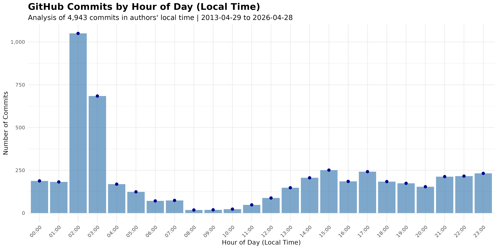
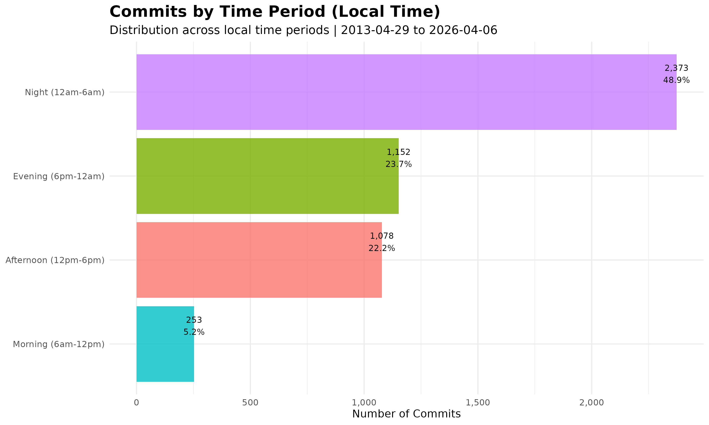
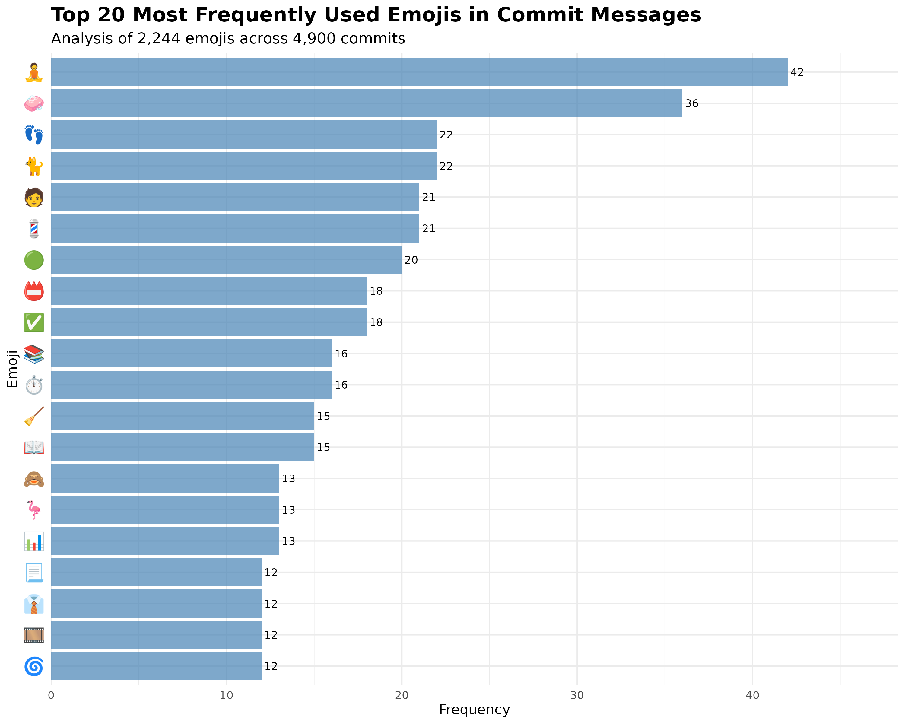
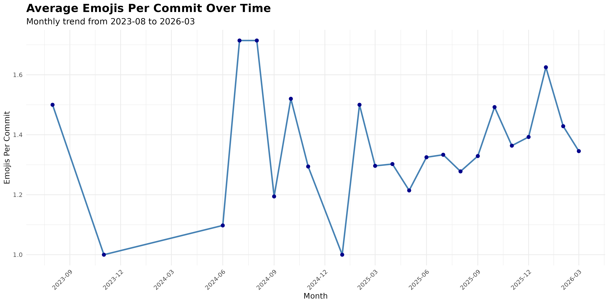
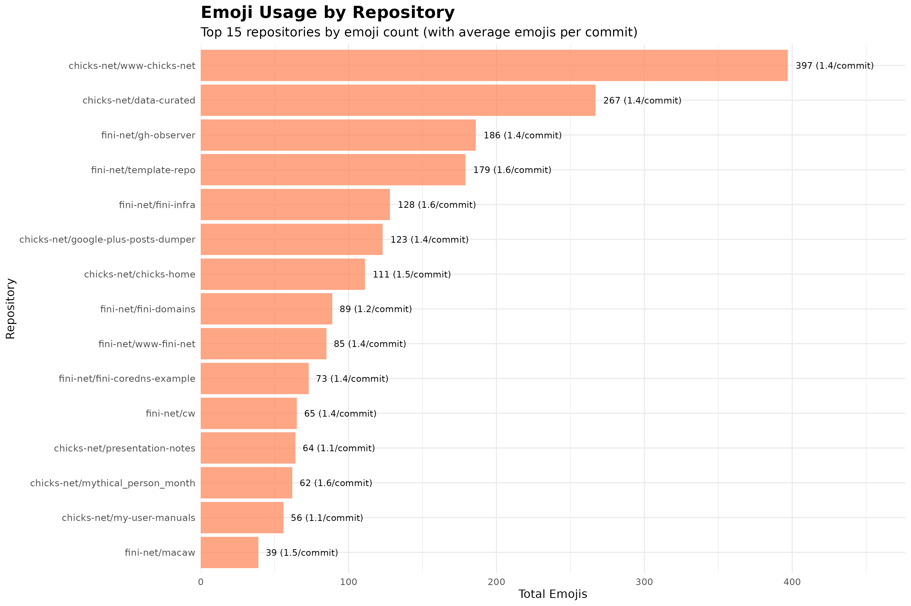

# Commits Analysis

This directory contains R scripts and results for analyzing GitHub commit
patterns and emoji usage in commit messages.

**Important:** All hours in this analysis are shown in **commit authors' local
timezones**. The original commit data spans multiple timezones and is analyzed
as-is to preserve the actual patterns of when people commit in their local
time.

## Key Findings

### Emoji Usage Statistics

*Analysis from February 7, 2026:*

- **89.4%** of commits contain emojis (1,116 out of 1,249 commits)
- **1,612** total emojis used across all commits
- **556** unique emojis found in commit messages
- **1.44** average emojis per commit (when emojis are used)
- Most common emoji: 🧼 (used 36 times)
- Top 300 emojis account for 80% of all emoji usage

## Files

### Commit Time Analysis

- `analyze-commits-by-hour.R` - R analysis script for commit timing
- `commits-by-hour.png` - Bar chart showing commit frequency by hour (local time)
- `commits-by-time-period.png` - Grouped by morning/afternoon/evening/night (local time)
- `hourly-commit-distribution.csv` - Raw hourly data (local time)
- `time-period-distribution.csv` - Time period aggregated data (local time)
- `timezone-distribution.csv` - Original timezone distribution of commits

### Emoji Usage Analysis

- `analyze-emoji-usage.R` - R analysis script for emoji frequency
- `emoji-frequency.png` - Top 20 most frequently used emojis
- `emoji-timeline.png` - Average emojis per commit over time
- `emoji-by-repo.png` - Emoji usage by repository
- `emoji-frequency.csv` - Complete emoji frequency data
- `emoji-timeline.csv` - Monthly emoji usage trends
- `emoji-by-repo.csv` - Repository-level emoji statistics
- `emoji-summary.csv` - Overall emoji usage statistics

## Running the Analysis

Ensure R dependencies are installed:

```bash
just install-r-deps
```

Then run all analyses using the just recipe:

```bash
just analyze-commits
```

Or run individual analyses:

```bash
cd individuals/chicks/github/commits-analysis
Rscript analyze-commits-by-hour.R
Rscript analyze-emoji-usage.R
```

## Visualizations

### Commit Time Patterns





### Emoji Usage







## Data Source

Analysis uses the `commits.db` SQLite database contains over 1000
recent GitHub commits, fetched via the GitHub Search API.
