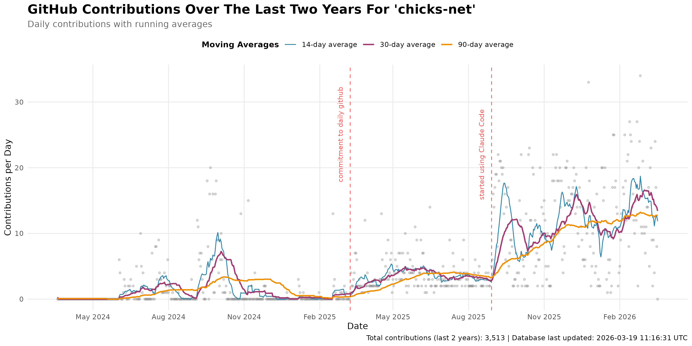
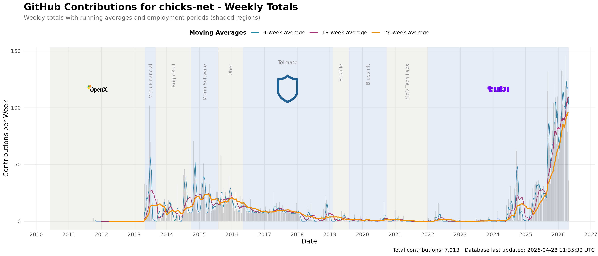
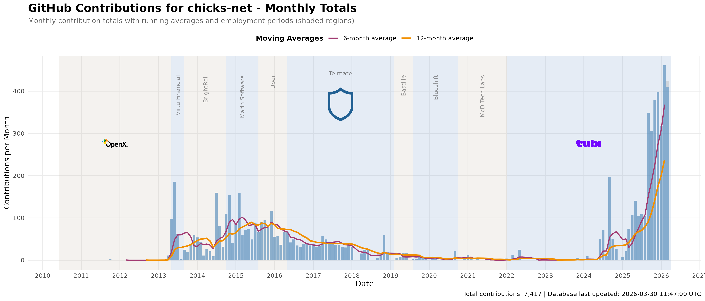

# GitHub Contributions Analysis

## Overview

This directory contains R scripts for analyzing GitHub contribution data from
the `contributions.db` SQLite database.  The analysis visualizes GitHub
contribution patterns over time using daily contribution counts with running
averages to show trends.

## Visualizations

### 1. Recent Activity (Last 2 Years)

Shows daily contribution points with three running averages to identify
short-term, medium-term, and long-term trends.

- **Gray points**: Daily contribution counts
- **Blue line**: 14-day running average (biweekly trend)
- **Purple line**: 30-day running average (monthly trend)
- **Orange line**: 90-day running average (quarterly trend)



### 2. Weekly Totals (2011-Present)

Shows weekly aggregated contributions with running averages scaled to show
the overall activity arc across your entire GitHub history.

- **Gray bars**: Weekly contribution totals
- **Blue line**: 4-week running average (~1 month)
- **Purple line**: 13-week running average (~1 quarter)
- **Orange line**: 26-week running average (~6 months)



### 3. Monthly Totals

Shows monthly contribution totals with multi-month running averages to
identify seasonal patterns and long-term trends.

- **Blue bars**: Monthly contribution totals
- **Purple line**: 6-month running average (semi-annual trend)
- **Orange line**: 12-month running average (annual trend)



## Prerequisites

```bash
# Install R (macOS)
brew install r

# Install required R packages
Rscript -e 'install.packages(c("DBI", "RSQLite", "ggplot2", "dplyr", "zoo", "lubridate", "scales"), repos="https://cloud.r-project.org")'

# Or use just to save typing and install required R packages!
just install-r-deps
```

## Running the Analysis

```bash
# Recommended: Use the just command (from anywhere in the repo)
just analyze-contributions

# Or run Rscript directly (from this directory)
Rscript analyze-contributions.R

# Or make it executable and run directly (from this directory)
chmod +x analyze-contributions.R
./analyze-contributions.R
```

## Sample Output

```text
Connecting to database: ../contributions.db
Loaded 5228 records

=== SUMMARY STATISTICS ===

Date range: 2011-10-03 to 2026-01-23
Total days: 5228
Total contributions: 6311
Average contributions per day: 1.21
Median contributions per day: 0
Max contributions in a day: 33
Days with no contributions: 3193
Days with contributions: 2035

=== LAST 90 DAYS ===

Total contributions: 1009
Average per day: 10.97
Active days: 91

Creating contribution graph...
Saved: contributions-last2years.png

Creating weekly contribution graph...
Saved: contributions-weekly.png

Creating monthly contributions graph...
Saved: contributions-monthly.png

Analysis complete!
```

## Analysis Details

### Data Processing

- Fetches most recent contribution count for each date (handles duplicate fetches)
- Calculates rolling averages using the `zoo` package
- Recent view filters to last 730 days for better granularity
- All-time view aggregates by week for readability across 14+ years
- Monthly view aggregates by month to show seasonal patterns and yearly trends

### Running Averages

Running averages are calculated with `align="right"`, meaning each point
represents the average of that day plus the previous N-1 days. This provides
a smoothed view of contribution trends while keeping the data current.

### Key Metrics

- **Total contributions**: Sum of all daily contribution counts
- **Active days**: Days with at least one contribution
- **Average per day**: Mean contributions across all days (including zeros)
- **Peak day**: Maximum contributions recorded in a single day

## Data Source

The analysis uses data from `individuals/chicks/github/contributions.db`,
which is populated by the `github-contributions.go` program that fetches
contribution calendar data from the GitHub GraphQL API.

Run `just fetch-contributions` to update the database with the latest data.

See `individuals/chicks/github/README.md` for details on data collection.
