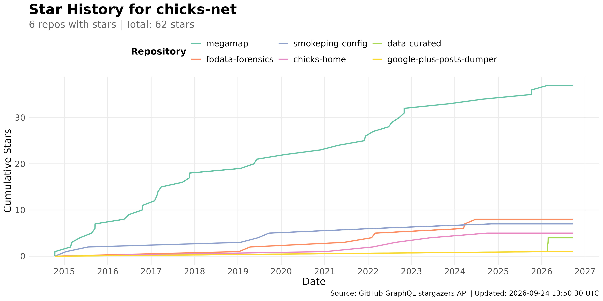
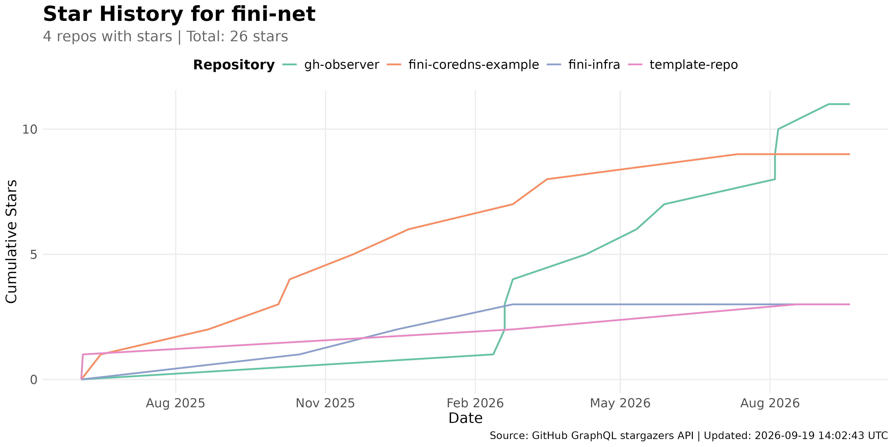

# GitHub Star History Analysis

## Overview

This directory contains an R script that replicates the star-history.com charts
locally by fetching stargazer timestamps from the GitHub GraphQL API and
plotting cumulative star counts over time per repository.  The output PNGs are
served from this repo via `raw.githubusercontent.com` so the brag page at
<https://www.chicks.net/links/brag/> no longer depends on the
`api.star-history.com` service (which was returning 503).

## Visualizations

### chicks-net

Cumulative star history for the chicks-net org repositories:
`megamap`, `fbdata-forensics`, `smokeping-config`, `chicks-home`,
`google-plus-posts-dumper`, and `data-curated`.



### fini-net

Cumulative star history for the fini-net org repositories:
`fini-coredns-example`, `template-repo`, `fini-infra`, and `gh-observer`.



## Prerequisites

```bash
# Install R (macOS)
brew install r

# Install required R packages (covers all analysis scripts in this repo)
just install-r-deps

# Or install only the packages this script needs
Rscript -e 'install.packages(c("ggplot2", "dplyr", "tidyr", "zoo", "lubridate", "scales", "jsonlite"), repos="https://cloud.r-project.org")'
```

The script shells out to `gh` (the GitHub CLI) for authenticated GraphQL
access, so `gh` must be installed and authenticated:

```bash
brew install gh
gh auth login
```

In CI the `GH_TOKEN` environment variable is used (set by the GitHub Actions
workflow).

## Running the Analysis

```bash
# Recommended: Use the just command (from anywhere in the repo)
just analyze-star-history

# Or run Rscript directly (from this directory)
Rscript analyze-star-history.R
```

## Sample Output

```text
=== STAR HISTORY ANALYSIS ===


--- chicks-net ---
Fetching stargazers for chicks-net :
  Fetching chicks-net/megamap ...
     37 stars across 1 page(s)
  Fetching chicks-net/fbdata-forensics ...
     8 stars across 1 page(s)
  ...
Saved: star-history-chicks-net.png

--- fini-net ---
Fetching stargazers for fini-net :
  Fetching fini-net/fini-coredns-example ...
     9 stars across 1 page(s)
  ...
Saved: star-history-fini-net.png

Analysis complete!
```

## How It Works

1. For each repo, paginate the GraphQL `repository.stargazers` connection
   (100 edges per page, ordered by `STARRED_AT ASC`) collecting `starredAt`
   timestamps.
2. Compute a cumulative count per repo per day (each star adds one to that
   repo's running total from its `starredAt` date onward).
3. Plot one line per repo with `ggplot2` (`geom_line` over actual star-event
   points plus a zero start point per repo and a current-date endpoint), one
   PNG per org.  Straight diagonal segments connect sparse star events (no
   daily-grid flat-with-jumps jaggedness), and each repo's line extends
   horizontally to today.
4. Repos with zero stars are skipped (no line drawn, omitted from the legend).

## Data Source

GitHub GraphQL API via `gh api graphql`:

```graphql
query($cursor: String) {
  repository(owner: "ORG", name: "REPO") {
    stargazers(first: 100, after: $cursor,
               orderBy: {field: STARRED_AT, direction: ASC}) {
      totalCount
      edges { starredAt node { login } }
      pageInfo { endCursor hasNextPage }
    }
  }
}
```

The `starredAt` field on each stargazer edge provides the date a star was
added, which is what star-history.com uses to draw its cumulative-star charts.

## Updating

This analysis runs automatically as part of `just github-update-all` (and the
daily `github-update.yml` GitHub Action), so the PNGs refresh whenever the
GitHub data pipeline runs.  To refresh manually:

```bash
just analyze-star-history
```

See `individuals/chicks/github/README.md` for the broader GitHub data
collection pipeline.
