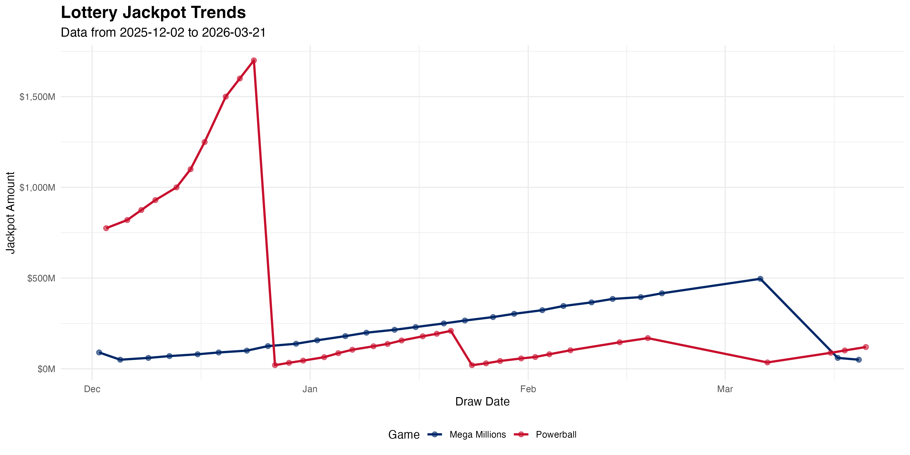
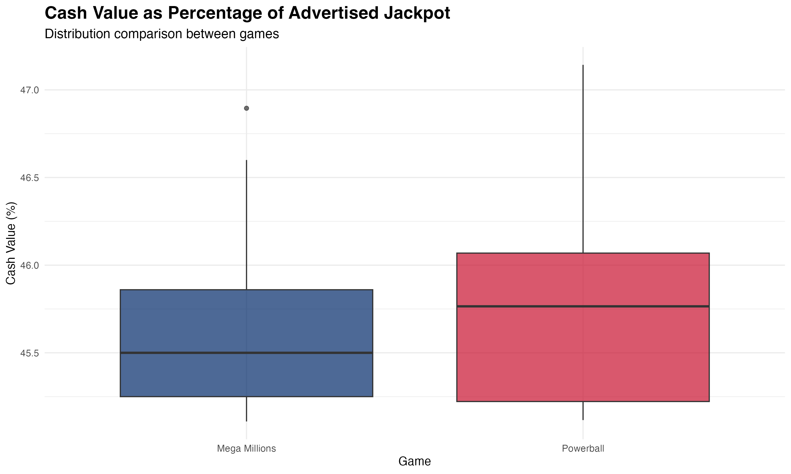
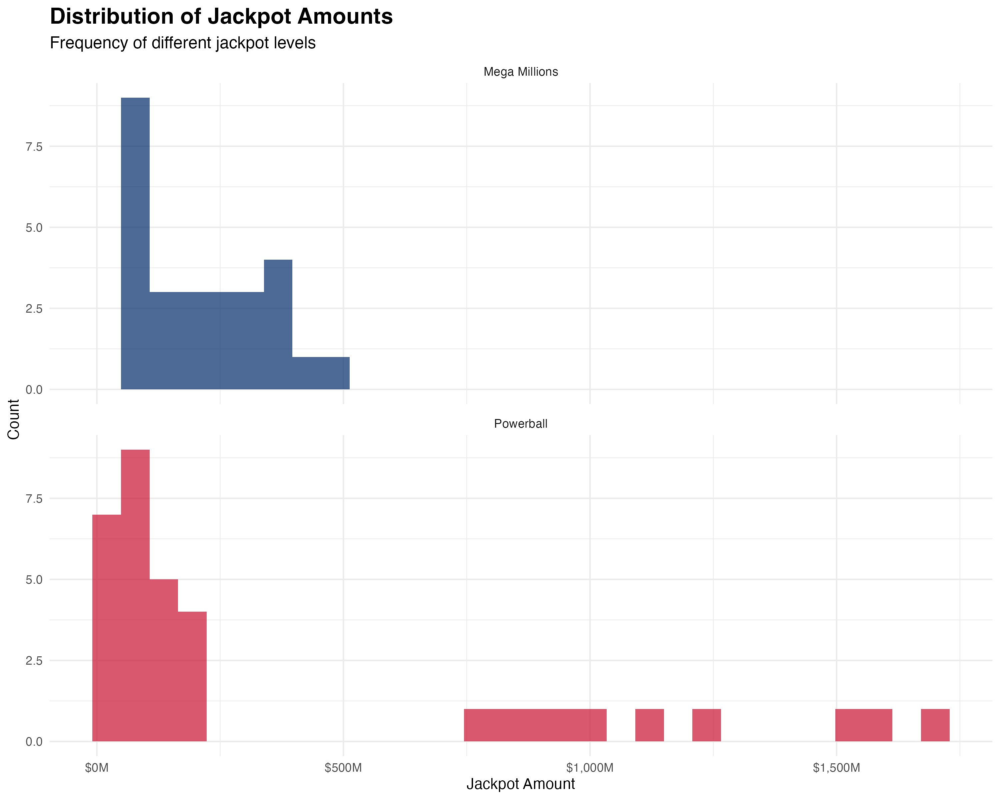

# Lottery Jackpots Analysis

This directory contains R scripts for analyzing California Lottery jackpot data
from the `jackpots.db` SQLite database.

## Overview

The analysis examines jackpot trends for Mega Millions and Powerball games,
tracking how jackpots change over time, comparing cash values to advertised
amounts, and identifying patterns in jackpot growth and resets.

## Prerequisites

```bash
# Install R (macOS)
brew install r

# Install required R packages
Rscript -e 'install.packages(c("DBI", "RSQLite", "ggplot2", "dplyr", "tidyr", "lubridate", "scales"), repos="https://cloud.r-project.org")'
```

## Running the Analysis

```bash
# Recommended: Use the just command (from anywhere in the repo)
just analyze-jackpots

# Or run Rscript directly (from the repository root)
Rscript lottery/jackpots-analysis/analyze-jackpots.R

# Or make it executable and run directly (from this directory)
chmod +x analyze-jackpots.R
./analyze-jackpots.R
```

## Output

The script generates both text output and visualizations:

### Text Output

- Summary statistics for each game (min/max/avg jackpots)
- Jackpot trend analysis (increases vs resets)
- Current jackpot status
- Cash value percentage statistics

### Visualizations

#### 1. Jackpot Trends Over Time

Line chart showing how jackpots change over time for both games, clearly
showing growth periods and resets when someone wins.



#### 2. Cash Value Percentage Comparison

Box plot comparing the cash value percentage between Mega Millions and Powerball.



#### 3. Jackpot Amount Distribution

Histogram showing the frequency distribution of different jackpot amounts for
each game.



#### 4. Jackpot Changes Between Draws

Line chart showing the change in jackpot amount between consecutive draws
(positive = increase, negative = reset/win).


## Analysis Details

### Data Processing

- Removes duplicate checks of the same draw (keeps most recent check)
- Converts jackpot amounts to millions for readability
- Calculates cash value as percentage of advertised jackpot
- Tracks changes between consecutive draws

### Key Metrics

- **Jackpot Increases**: When jackpot grows between draws (no winner)
- **Jackpot Resets**: When jackpot drops (someone won the jackpot)
- **Cash Percentage**: Ratio of lump-sum cash option to advertised annuity amount
- **Draw Frequency**: Number of draws tracked per game

## Data Source

The analysis uses data from `lottery/jackpots.db`, which is populated by the
`jackpot-checker.go` program that fetches data from the California Lottery API.

See `lottery/JACKPOT-README.md` for details on data collection.
