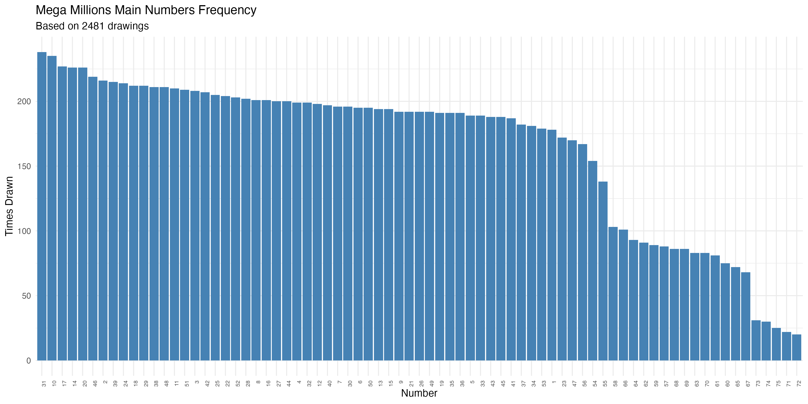
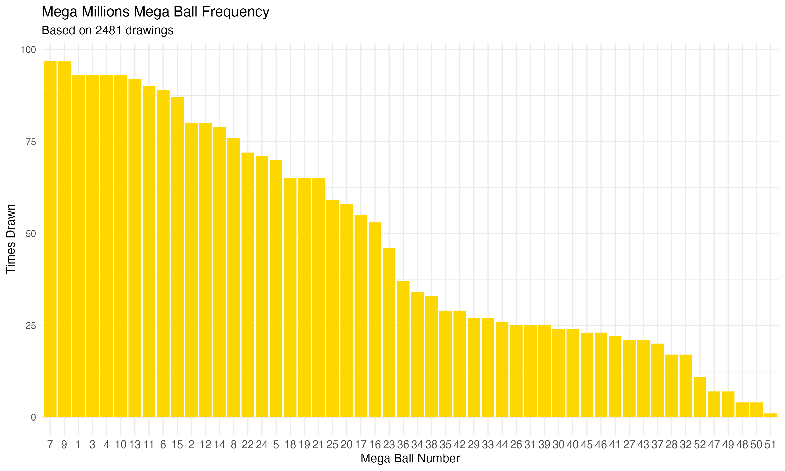

# Mega Millions Number Frequency Analysis

Ever wondered if some lottery numbers really do come up more often than
others? Well, now you can find out with cold, hard data.

This R program analyzes the complete history of Mega Millions winning numbers
from the NY Lottery dataset (starting in 2002) to show you which numbers have
been drawn most frequently.

## Quick Start

Make sure you've got R and tidyverse installed, then run:

```bash
cd lottery/megamillions-analysis
Rscript analyze-megamillions.R
```

The script will crunch through all the historical drawings and generate:

- Frequency tables (CSV files)
- Bar chart visualizations (PNG files)
- Console output with top/bottom performers

## Analysis Results

Based on **2,466 drawings** from May 17, 2002 to January 9, 2026:

### Main Numbers (1-70)

**Most frequently drawn:**

- 31 (238 times)
- 10 (235 times)
- 17 (227 times)
- 14 (226 times)
- 20 (225 times)

**Least frequently drawn:**

- 72 (20 times)
- 71 (22 times)
- 75 (25 times)
- 74 (30 times)
- 73 (31 times)



### Mega Ball (1-25)

**Most frequently drawn:**

- 7 and 9 (97 times each)
- 3 and 10 (93 times each)
- 1, 4, and 13 (91 times each)



## Output Files

The analysis generates these files:

- `megamillions-main-numbers-frequency.csv` - Complete frequency table for
  all 75 main numbers
- `megamillions-mega-ball-frequency.csv` - Complete frequency table for all
  Mega Balls
- `megamillions-main-numbers-chart.png` - Bar chart visualization of main
  number frequencies
- `megamillions-mega-ball-chart.png` - Bar chart visualization of Mega Ball
  frequencies

## About the Data

The source data comes from the NY Lottery's official Mega Millions winning
numbers dataset, which goes back to the game's inception in 2002. The CSV file
lives in the parent `lottery/` directory.

Note that numbers 71-75 appear less frequently because they were only added to
the pool more recently when Mega Millions expanded the number range. Before
October 2017, the main numbers only went up to 75, and before that it was even
smaller. So don't go thinking those high numbers are "due" - they just haven't
been in the game as long.

## Technical Details

The R script uses tidyverse for data wrangling and ggplot2 for visualizations. It:

1. Reads the CSV file from the parent directory
2. Parses the space-separated winning numbers
3. Counts frequency for each number and Mega Ball
4. Generates summary statistics (mean, median, standard deviation)
5. Creates bar charts sorted by frequency
6. Exports everything to CSV and PNG files

The whole thing runs in a few seconds, even with decades of lottery data.
