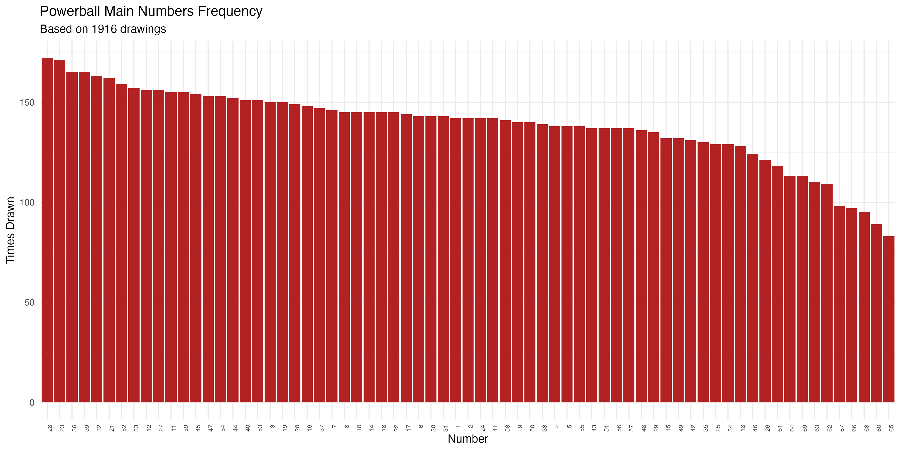
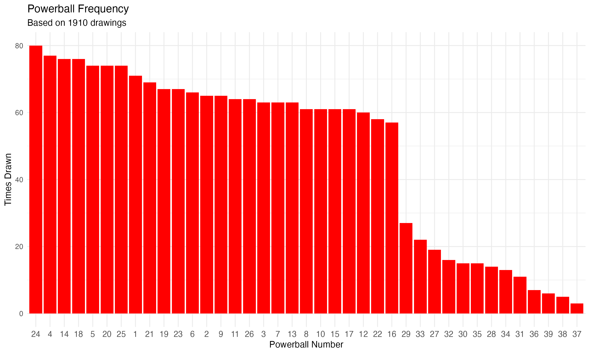

# Powerball Number Frequency Analysis

Ever wondered if some lottery numbers really do come up more often than
others? Well, now you can find out with cold, hard data.

This R program analyzes the complete history of Powerball winning numbers
from the NY Lottery dataset (starting in 2010) to show you which numbers have
been drawn most frequently.

## Quick Start

Make sure you've got R and tidyverse installed, then run:

```bash
cd lottery/powerball-analysis
Rscript analyze-powerball.R
```

If you don't have tidyverse installed, run this in R first:

```r
install.packages("tidyverse")
```

The script will crunch through all the historical drawings and generate:

- Frequency tables (CSV files)
- Bar chart visualizations (PNG files)
- Console output with top/bottom performers

## Analysis Results

Based on **1,887 drawings** from February 3, 2010 to January 10, 2026:

### Main Numbers (1-69)

**Most frequently drawn:**

- 23 and 28 (168 times each)
- 39 (164 times)
- 32 (163 times)
- 36 (162 times)
- 21 (159 times)

**Least frequently drawn:**

- 65 (81 times)
- 60 (86 times)
- 68 (93 times)
- 66 (96 times)
- 67 (98 times)



### Powerball (1-26)

**Most frequently drawn:**

- 24 (78 times)
- 4, 14, and 18 (75 times each)
- 25 (74 times)
- 20 (73 times)
- 5 (72 times)



## Output Files

The analysis generates these files:

- `powerball-main-numbers-frequency.csv` - Complete frequency table for
  all 69 main numbers
- `powerball-ball-frequency.csv` - Complete frequency table for all
  Powerball numbers
- `powerball-main-numbers-chart.png` - Bar chart visualization of main
  number frequencies
- `powerball-ball-chart.png` - Bar chart visualization of Powerball
  frequencies

## About the Data

The source data comes from the NY Lottery's official Powerball winning
numbers dataset, which goes back to February 2010. The CSV file
lives in the parent `lottery/` directory.

Unlike Mega Millions, the Powerball data combines all six numbers in a single
field - the first five are the main numbers (1-69) and the sixth number is
the Powerball (1-26). The script parses these accordingly.

The higher numbers (60-69) appear less frequently because they were only added
to the pool more recently when Powerball expanded the number range in October
2015. Before that expansion, the main numbers only went up to 59. So don't go
thinking those high numbers are "due" - they just haven't been in the game as
long.

## Technical Details

The R script uses tidyverse for data wrangling and ggplot2 for visualizations. It:

1. Reads the CSV file from the parent directory
2. Splits the space-separated winning numbers into 6 values
3. Separates the first 5 numbers (main) from the 6th (Powerball)
4. Counts frequency for each number and Powerball
5. Generates summary statistics (mean, median, standard deviation)
6. Creates bar charts sorted by frequency
7. Exports everything to CSV and PNG files

The whole thing runs in a few seconds, even with over 15 years of lottery data.
